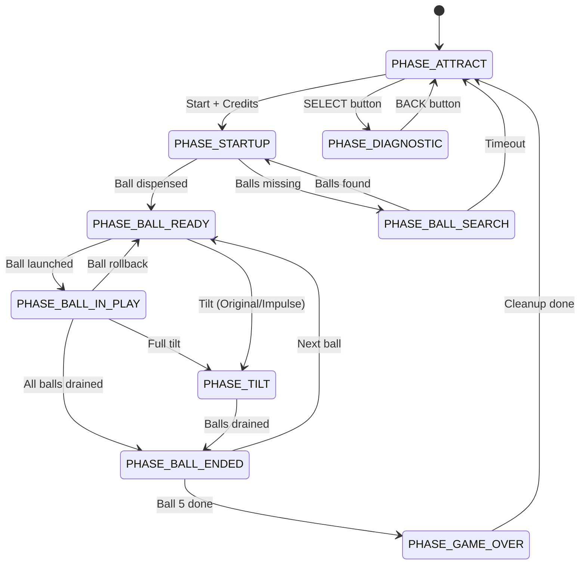

# 1954 Williams Screamo - Modernized Control System Overview
Rev: 01-31-26. Revised by RDP and Claude Opus 4.5.

## 1. Introduction

Screamo was originally a 1954 single-player Williams pinball machine, and has since been cosmetically and mechanically restored. This project modernizes the control system while preserving the original gameplay experience as much as possible, plus adding a new Enhanced game style with modern features.

Originally, all rules, scoring, and features were handled by electromechanical (EM) devices:

- Score Motor: advanced scores in increments of 50,000 or 500,000 points.
- Relay Banks: tracked progress toward features.
- Score Units: mechanical stepper units that advanced and displayed score via illuminated digits in the head, in increments of 10,000 points.
- Buttons and switches: responded to player and ball actions.
- Playfield lamps: indicated active features and feature progress.
- Coils: moved the ball on the playfield (pop bumper, side kickouts, slingshots, etc.) and controlled mechanisms (ball tray release, stepper units, etc.)
- Relays: handled game state and scorekeeping.

This project replaces most of the EM logic with two Arduino Mega 2560 R3 boards (Master and Slave) while preserving the original feel, sounds, and behavior as much as possible, plus adding a new Enhanced game style and a complete diagnostics and settings system.

NOTE: The score is displayed to the player via lamps that illuminate numbers in the head, rather than a digital display. Possible scores range from 10,000 to 9,990,000 points, in increments of 10,000 points. Thus, there are 999 possible score values, and internally we represent the score as an integer from 1 to 999, where each unit represents 10,000 points.

NOTE: Regarding "Mode" versus "Style." We use the term Mode interchangably to mean either 1) The type of game being played (Original, Impulse, or Enhanced) or 2) the special "game-within-a-game" used in Enhanced mode (Bumper Cars, Roll-A-Ball, Gobble Hole Shooting Gallery.)  Technically we should refer to Original/Impuls/Enhanced as the game Style, and the game-within-a-game as the Mode. Hopefully the reader will be able to descern when our use of the word Mode actually refers to game Style.

---

## 2. High-Level Architecture

- Master Arduino (in cabinet)
  - Owns all game rules and most real-time behavior.
  - Controls playfield and cabinet coils, playfield lamps, shaker motor, Tsunami audio system, ball handling, and Score Motor / EM sound devices.
  - Talks to the Slave via RS-485 messages.
  - Manages Diagnostic mode and style selection (Original / Enhanced / Impulse).

- Slave Arduino (in head)
  - Owns lit-from-behind-backglass score display (including Tilt lamp and head GI lamps) and head hardware.
  - Controls devices in the head:
    - Score lamps (Nine each of 10K, 100K, and 1M lamps).
    - Tilt and GI lamps in the head.
    - Three bells (10K, 100K, Select).
    - 10K Unit (for mechanical sound only).
    - Credit Unit (add/deduct credits; credits visible to player through a mechanical display).
  - Receives score, credit, and state commands and queries via RS-485 from Master.
  - Responsible for realistic timing of score updates and bells, matching the original Score Motor behavior.

- Communication
  - Master sends high-level commands to Slave (for example: "add 50K to Player 1 score", "set TILT lamp ON", "set head GI OFF").
  - Slave translates those into stepper pulses, bell rings, and lamp updates, timed to emulate original mechanical behavior.
  - Master can query Slave for credit status (only whether one or more credits are available, not how many).
  - Master can query Slave for the current score, but only for diagnostic purposes; Master is the authority on score.
  - Further RS485 commands can be established between Master and Slave should they be needed.

---

## 3. Original vs Modern Hardware

### 3.1 Original Mechanisms Still Used Normally

These remain and are still used as active game mechanisms:

- Flipper buttons and flippers (mechanically upgraded, but same function) (playfield).
- Pop bumper and dead bumpers (playfield).
- Left and right side kickouts (playfield).
- Left and right slingshots (playfield).
- Credit Unit (head).
- Ball Tray Release (original coil) (playfield).
- Lamps (playfield and head).
- Most switches (head, playfield and cabinet) including the coin mechanism switch and the Start button.

### 3.2 Original Mechanisms Used Only for Sound Effects

These remain physically present and are driven only for sound authenticity (no game logic is derived from them):

- Three scoring bells (10K, 100K, Select) (head).
- 10K Score Unit (head). In order to "reset" the 10K unit to zero, it must advance all the way around back to zero even if it is already at zero.
- Knocker (cabinet).
- Score Motor (cabinet).
- Selection Unit (underside of playfield).
- Relay Reset Unit (underside of playfield). The original game has two Relay Reset Banks, but we retain only one; we will fire it twice when the original game would have fired both once.

The actual scoring and rule decisions are all handled in software.

### 3.3 New / Modern Hardware

- Two Arduino Mega 2560 R3 boards
  - Master (in cabinet): controls playfield and cabinet devices, game rules, modes, and diagnostics.
  - Slave (in head): controls head devices, score display, and head diagnostics via commands from Master.

- Centipede shift register I/O expanders
  - Controlled by Arduinos via I2C commands.
  - Input Centipede (cabinet): reads switch status (playfield and cabinet switches).
  - Output Centipede (cabinet): drives 6.3vac incandescent playfield lamps (via modern cube relay modules).
  - Output Centipede (head): drives 12vdc LED head lamps (via modern cube relay modules).

- Relay modules (cabinet and head)
  - Modern relays, digitally controlled by Centipede outputs, in turn provide power to lamps.
  - Pulling a Centipede output LOW effectively turns on a lamp (or group of lamps in the case of head GI).
  - Switch 6.3 VAC to playfield lamps (cabinet).
  - Switch 12 V DC to head lamps (head).
  - Software does not need to know about relay details; only that controlling Centipede outputs (indirectly) controls lamps.

- MOSFET drivers (cabinet and head)
  - Controlled by Arduino PWM and digital pins to fire coils and control the shaker motor with adjustable power and timing.

- Solid-state relay (in cabinet)
  - Controlled by Master via digital pins.
  - Switches 50 VAC to Score Motor (on/off control only; no speed control).
  - For sound effect only; Master controls timing to match score updates.

- Shaker Motor (in cabinet)
  - Controlled by Master via PWM MOSFET.
  - For tactile feedback in Enhanced game style; speed and duration controlled by PWM.

- Audio System (in cabinet)
  - Controlled by Master via RS-232 serial commands.
  - Tsunami WAV Trigger board (controlled by Master).
  - Amplifier and speaker.
  - Plays simultaneous voice, music, and sound effects, primarily in Enhanced style.

- LCD Displays (on inside of coin door and in head)
  - Controlled by Arduinos via RS-232 serial commands.
  - Two 20x4 (4 lines of 20 characters each) Digole LCDs:
    - One connected to the Master (inside coin door) for status, diagnostics, and settings.
    - One connected to the Slave (in the head) for head diagnostics.
    - Neither is visible to players during normal play; they are used for diagnostics and monitoring by the operator.

- Diagnostics 4-Pushbutton Module (on inside of coin door)
  - Four diagnostic buttons in the coin door: BACK, LEFT, RIGHT, SELECT.
  - Used in Game Over / Diagnostic mode; also used in-game for Tsunami volume (LEFT/RIGHT).

- New Ball Trough Release Mechanism (mounted at lower end of Ball Trough) (below playfield)
  - Up/down post releases individual balls from the Ball Trough into the base of Ball Lift.
  - Controlled by Master via PWM MOSFET.
  - See Section 3.4 for Ball Flow details.

- New Ball In Lift Switch (mounted in base of Ball Lift mechanism) (below playfield)
  - 'SWITCH_IDX_BALL_IN_LIFT' - Switch read by Master via Input Centipede.
  - Detects when a ball is present at the base of the Ball Lift, waiting to be pushed up into the Shooter Lane.

- New 5 Balls In Trough Switch (mounted below Ball Trough) (below playfield)
  - 'SWITCH_IDX_5_BALLS_IN_TROUGH' - Switch read by Master via Input Centipede.
  - Detects when five balls are present in the Ball Trough.
  - When this switch is OPEN, fewer than five balls are in the trough.

### 3.4 Ball Flow and Ball Handling Mechanisms

Understanding how the ball moves through the machine is critical for game logic:

**Physical Areas (from playfield to shooter lane):**

1. **Playfield**: Where the ball is in play. Balls can drain from the playfield only two ways:
   - Via one of the three bottom Drain Rollovers (left, center, right; each of which has a rollover switch that closes whenever a ball drains over it).
   - Via the Gobble Hole (a hole near the center of the playfield; this hole also has a switch that closes whenever a ball drains through it).

2. **Ball Tray**: A collection area at the very bottom of the playfield that catches balls draining via the three bottom Drain Rollovers (left, center, right) but NOT balls draining via the Gobble Hole. The Ball Tray holds balls until the Ball Tray Release coil is fired, which opens the tray and allows balls to drop into the Ball Trough below.

3. **Ball Trough**: A holding area below the Ball Tray that can hold up to five balls. Balls enter the Ball Trough in two ways:
   - From the Ball Tray (when the Ball Tray Release coil is fired or is already open).
   - Directly from the Gobble Hole (balls draining via the Gobble Hole bypass the Ball Tray entirely and drop directly into the Ball Trough).
   
   The Ball Trough has a switch ('SWITCH_IDX_5_BALLS_IN_TROUGH') that closes when five balls are present.

4. **Ball Trough Ball Release**: A new up/down post mechanism ('DEV_IDX_BALL_TROUGH_RELEASE') that releases one ball at a time from the Ball Trough into the base of the Ball Lift. Each carefully-timed pulse releases exactly one ball.

5. **Ball Lift**: A vertical channel where balls wait after being released from the Ball Trough. The Ball Lift has a switch ('SWITCH_IDX_BALL_IN_LIFT') at its base that detects when a ball is present. The player manually pushes the ball up through the Ball Lift using the Ball Lift Rod (a manually-operated plunger), which moves the ball from the base of the lift into the Shooter Lane. **The ball lift does NOT automatically launch balls.**

   **Ball Lift Switch Behavior:**
   - Switch CLOSED: A ball is resting at the base of the Ball Lift, ready for the player to push up.
   - Switch OPEN: Either no ball is present, OR the player is actively pushing the Ball Lift Rod (which lifts any ball out of the switch detection area).
   
   **Important Ball Lift Considerations:**
   - If the Ball Lift Rod is partially or fully pressed when we fire 'DEV_IDX_BALL_TROUGH_RELEASE', the released ball will be blocked and cannot drop into the base of the lift until the rod is fully released.
   - If a ball is already at the base of the lift ('SWITCH_IDX_BALL_IN_LIFT' closed), we should NOT release another ball - doing so could cause a jam.
   - While physically possible for two balls to occupy the Ball Lift simultaneously, this would cause a jam. If this occurs, the player can clear it by pressing the Ball Lift Rod fully to let balls drop into the Shooter Lane. Our software should avoid this situation by checking 'SWITCH_IDX_BALL_IN_LIFT' before releasing a ball.

6. **Shooter Lane**: The lane at the top of the Ball Lift where the ball rests before the player uses the shooter (main plunger) to launch it onto the playfield. **The player must pull and release the shooter to launch the ball.**

**Ball Flow Summary:**
```
Playfield --->---+---> Drain Rollovers (L/C/R) ---> Ball Tray ---> [Ball Tray Release coil]
    ^            |                                                            |
    |            |                                                            v
    |            +---> Gobble Hole ---> -----------directly------------> Ball Trough
    |                                                                         |
    |                                                          [Ball Trough Ball Release coil]
    |                                                                         |
    |                                                                         v
    |                                                                Base of Ball Lift
    |                                                                         |
    |                                                      (closes "Ball at base of lift" switch)
    |                                                                         |
    |                                                          [Player pushes Ball Lift Rod]
    |                                                                         |
    |                                                       (opens "Ball at base of lift" switch)
    |                                                                         |
    |                                                                         v
    |                                                                   Shooter Lane
    |                                                                         |
    |                                                                 [Player shoots]
    |                                                                         |
    +<--------------<-------------------<----------------<--------------------+
```
**Switch Reliability Notes:**

- The 'SWITCH_IDX_GOBBLE' (Gobble Hole) switch closes reliably every time a ball enters the Gobble Hole. With our 10ms main loop checking switch states, it is extremely unlikely to miss a ball. However, our ball tracking logic should be resilient - if we somehow miss detecting a Gobble drain, the worst consequence should be the player not receiving points for that drain, not a corrupted ball count that breaks the game.

- The 'SWITCH_IDX_5_BALLS_IN_TROUGH' switch reliably indicates when exactly five balls are present in the Ball Trough.
  - When OPEN, we know at least one ball is elsewhere (playfield, Ball Tray, Ball Lift, Shooter Lane, or stuck somewhere).
  - EXCEPTION: When balls enter the Ball Trough from either the Gobble Hole or the Ball Tray, there may be a brief moment when the switch closes as a ball rolls over it, even though five balls are not present. Our ball tracking logic should account for this transient condition by confirming that either:
    - At the start of a game, before we open the Ball Tray, if the switch is closed, we assume all five balls are in the trough.
    - At any other time, we must confirm the switch remains closed for a short duration (we use BALL_DETECTION_STABILITY_MS, currently set to 1000ms) before assuming five balls are present.

**Key Software Implications:**
- When balls drain via Drain Rollovers, the Ball Tray collects them. Software must fire 'DEV_IDX_BALL_TRAY_RELEASE' to drop them into the Ball Trough before they can be dispensed, unless the Ball Tray is already open.
- When balls drain via Gobble Hole, they go directly to the Ball Trough (no Ball Tray Release needed).
- To dispense a ball to the player, when the Ball Lift switch is open (no ball present in lift), fire 'DEV_IDX_BALL_TROUGH_RELEASE' to release one ball from the Ball Trough into the Ball Lift. We should confirm that the Ball Lift switch transitions from Open to Closed within a short time (STARTUP_BALL_TROUGH_TO_LIFT_TIMEOUT_MS) (e.g., 3 seconds) to verify the ball was successfully released, else we should throw a critical error (e.g., "Ball Trough Jam") and end the game.
- The 'SWITCH_IDX_BALL_IN_LIFT' switch tells software when a ball is ready for the player to push into the Shooter Lane.
- The 'SWITCH_IDX_5_BALLS_IN_TROUGH' switch tells software whether all five balls are accounted for in the Ball Trough.

### 3.5 Ball Tracking

Master tracks all five balls at all times during gameplay. More details can be found in Section 10.3.1-10.3.8.

#### 3.5.1 Ball Locations

Each ball can be in one of these locations:
- **TRAY**: In the ball tray (above trough, drains when tray opens)
- **TROUGH**: In the ball trough (ready to dispense)
- **LIFT**: At the base of the ball lift (waiting for player to lift)
- **PLAYFIELD**: On the playfield (in active play), including shooter lane
- **KICKOUT_LEFT**: Captured in left kickout hole
- **KICKOUT_RIGHT**: Captured in right kickout hole

#### 3.5.2 Ball Counting Rules

- **5-balls-in-trough switch**: Only indicates all 5 balls are in trough; does not provide count of fewer balls
- **Ball-in-lift switch**: Indicates exactly one ball is at lift base
- **Kickout switches**: Each indicates one ball captured in that hole

Ball counts are derived from:
1. Initial state: All 5 balls assumed in tray or trough at game start
2. Dispense event: Decrement trough count when ball released to lift
3. Lift cleared (ball-in-lift switch opens after being closed): Ball now on playfield/shooter lane
4. Drain detected: Ball returning to tray (bottom rollovers) or trough (gobble hole)
5. Kickout capture: Ball in kickout (detected by kickout switch)
6. Kickout eject: Ball returns to playfield

#### 3.5.3 Sanity Checks

Master periodically validates ball counts:
- If 5-balls-in-trough switch is closed, ballsInTrough must be 5
- Total of all locations must equal 5
- If mismatch detected, log warning but do not interrupt gameplay

#### 3.5.4 Ball Tracking Implementation

Master uses **counter-based tracking** rather than per-ball location tracking:
- `ballsInPlay`: Count of balls actively on playfield (0-5)
- `ballInLift`: Boolean, true if a ball is waiting in lift
- `ballsLocked`: Count of balls in kickouts (0-2)

The locations in 3.5.1 are conceptual; software does not track which specific ball is where, only counts per location.

### 3.6 Ball Tray Management

The Ball Tray holds balls that have drained via the three bottom rollovers (left, center, right). Balls that drain via the Gobble Hole bypass the tray and go directly to the trough.

#### 3.6.1 Ball Tray Solenoid Characteristics

- **Initial Power**: 200 (PWM 0-255)
- **Hold Power**: 40 (PWM 0-255) - sufficient to keep tray open, minimizes heat
- **Activation Time**: 200ms at initial power before reducing to hold power

**Important:** While the solenoid can be held indefinitely at hold power, it will warm up if held open for extended periods. Thus we will use our Game Timeout feature to ensure if no scoring activity occurs for a defined period (BALL_SEARCH_TIMEOUT_MS), the game will end automatically, allowing the tray to close and the solenoid to cool down.

#### 3.6.2 Ball Tray States by Game Phase

| Phase                               | Original/Impulse | Enhanced    |
|-------------------------------------|------------------|-------------|
| Attract                             | Closed           | Closed      |
| Ball Recovery (waiting for 5 balls) | Open (held)      | Open (held) |
| Gameplay (before first score)       | Open (held)      | Open (held) |
| Gameplay (after first score)        | Closed           | Open (held) |
| Tilt (waiting for drain)            | Open (held)      | Open (held) |
| Game Over                           | Closed           | Closed      |

#### 3.6.3 Enhanced Mode Ball Tray During Gameplay

**Simplified Strategy:** In Enhanced mode, the Ball Tray remains OPEN for the entire game after startup. This provides several benefits:
- Balls draining via Drain Rollovers immediately fall into the Ball Trough
- Instant ball availability for Ball Save, Multiball, and Mode replacement
- No need to time tray open/close cycles around drain events
- The Ball Tray Release solenoid hold power (40 PWM) is safe for extended operation

---

## 4. Game Styles

Screamo runs in several styles. Master is style authority and informs Slave via RS-485.

### 4.1 Original Style

- Triggered by: Single press of Start button (no second or third press within detection windows).
- Single-player only.
- Rules and scoring match the original Screamo rules.
- Modernized flippers (a slight departure from original):
  - Independent control of each flipper.
  - Flippers can be held up indefinitely while the button is held (power is reduced after initial pulse).
- EM sound devices used:
  - Bells, 10K Unit, Score Motor, Selection Unit, Relay Reset Bank, Knocker.
- Goal: Make it feel like playing an unmodified original Screamo (except for the flipper operation).
- Shaker motor and Tsunami audio are not used in this style.

### 4.2 Enhanced Style

- Triggered by: Double-tap of Start button (second press within 500ms of first, with NO third press within 500ms of second).
- Single-player only for initial release; future upgrade will support multiple players in this mode.
- A new rule set, uses:
  - Tsunami audio system.
  - Shaker motor.
  - EM sound devices are NOT used in Enhanced style (no bells, Score Motor, 10K Unit, Selection Unit, or Relay Reset Bank during startup or gameplay except when specifically requested).
  - Exception: Modes and Multiball may have their own specific rules.
- Theme:
  - Roller-coaster / amusement park flavor.
  - Voice, music, and special effects.
  - Musical main theme can be toggled between Calliope/Circus music and Surf Rock (settable in Diagnostics Settings).
  - One of the two themes is used for music during regular Enhanced play, and the other theme music is played during modes and Multiball.
- Features:
  - Single player (future: up to four players).
  - Special game modes and scoring goals (details to be specified separately).
  - Ball save for first N seconds after the first point scored on each ball (time defined in Settings) OR if we drain the ball before hitting any targets.
  - Shaker motor triggered on certain events.
  - Extra voice prompts, music, jackpots, etc. (details to be specified separately).

### 4.3 Impulse Style

- Triggered by: Triple-tap of Start button (third press within 500ms of second press).
- Single-player only.
- Rules identical to Original style except for flipper behavior:
  - Impulse flippers:
    - Pressing either flipper button causes both flippers to fire briefly and immediately drop.
    - Flippers stay up for 'IMPULSE_FLIPPER_UP_TICKS' (default 10 ticks = 100ms) then drop.
    - Flippers cannot be held up.
    - A new press is required before flippers can be fired again.
- Intended to exactly reproduce the original 1954 impulse-flipper behavior and gameplay.
- EM sound devices used (same as Original style).
- Shaker motor and Tsunami audio are not used in this style.

**Impulse Flipper Constant:**

  const byte IMPULSE_FLIPPER_UP_TICKS = 10;  // 100ms flipper up time for Impulse style

### 4.4 Start Button Tap Detection Summary

**Window Timing:**
- Style detection window: 500ms (configurable via 'START_STYLE_DETECT_WINDOW_MS')
- Game mode is fully determined before ball recovery begins

**Three Start Patterns:**

| Pattern     | Timing                                                 | Result         |
|-------------|--------------------------------------------------------|----------------|
| Single tap  | No 2nd press within 500ms                              | Original Style |
| Double tap  | 2nd press within 500ms, no 3rd press within next 500ms | Enhanced Style |
| Triple tap  | 2nd press within 500ms, 3rd press within next 500ms    | Impulse Style  |

**Detailed Behavior Examples:**
```
**Original Style (Single Tap):**

T =   0ms: Start pressed (1st time) 
           Start 500ms timer
           DO NOT deduct credit yet
           Monitor for 2nd Start press
T = 500ms: Timer expires, no 2nd press detected
           gameStyle = ORIGINAL
           Check credits:
             IF credits: Proceed to ball recovery
             IF no credits: Stay in Attract mode (silent)

**Enhanced Style (Double Tap):**

T =   0ms: Start pressed (1st time)
           Start 500ms timer
           Monitor for 2nd Start press
T = 200ms: Start pressed (2nd time, within 500ms)
           Start NEW 500ms timer for potential 3rd press
           Monitor for 3rd Start press
T = 700ms: Timer expires, no 3rd press detected
           gameStyle = ENHANCED
           Check credits:
             IF credits: Proceed to ball recovery
             IF no credits: Play Aoooga + rejection announcement, stay in Attract

**Impulse Style (Triple Tap):**

T =   0ms: Start pressed (1st time)
           Start 500ms timer
           Monitor for 2nd Start press
T = 200ms: Start pressed (2nd time, within 500ms)
           Start NEW 500ms timer
           Monitor for 3rd Start press
T = 400ms: Start pressed (3rd time, within 500ms of 2nd)
           gameStyle = IMPULSE
           Check credits:
             IF credits: Proceed to ball recovery
             IF no credits: Stay in Attract mode (silent)
```
**Key Points:**
1. **Credit is confirmed but NOT deducted until AFTER five balls confirmed**
2. **Zero credits behavior:**
   - Original/Impulse: Silent, stay in Attract mode
   - Enhanced: Aoooga horn + random rejection announcement, then Attract mode
3. **No audio until style is determined:**
   - Keeps Enhanced/Impulse styles hidden from casual players
   - Original/Impulse: Only mechanical EM sounds
   - Enhanced: SCREAM sound effect on game start

**Ball Tray Timing:**
- Ball Tray opens AFTER style is determined and credits are confirmed.
- This is safe because style detection completes within 1 second max.

**Start button during gameplay:**
- **Before first point scored:** Start presses are ignored.
- **After first point scored:**
  - If credits available: Pressing Start ends the current game and begins tap detection for new game.
  - If no credits: Start presses are ignored.

### 4.5 Game Over / Attract Mode

- Default mode on power-up and at the end of each game.
- Typical behavior:
  - Head and playfield GI on.
  - TILT lamp off.
  - Prior score displayed (or re-displayed from non-volatile storage).
- In this mode, Master:
  - Waits for Start button presses, coin insertions, knock-off button, or Diagnostic button presses.
  - Auto-ejects any balls detected in side kickouts (cleanup).

### 4.6 Tilt Behavior

Tilting always affects only the CURRENT BALL; it never ends the game prematurely (unless it was the last ball).

- When the game is tilted in Enhanced mode:
  - On first tilt: WARNING ONLY, not a full tilt.
    - Play tilt warning voice announcement (randomly chosen from a set).
    - Return to play
  - On second tilt, same ball: FULL TILT.
    - Play TRACK_TILT_BUZZER buzzer sound effect.
    - Play full tilt voice announcement (randomly chosen from a set).
- When the game is fully tilted in any playing style (1st tilt in Original/Impulse, 2nd tilt in Enhanced):
  - Flippers are disabled.
  - All playfield lights momentarily turn off.
  - Any balls in side kickouts are retained (locked balls carry over to next ball).
  - TILT lamp is turned on and flashes for about 4 seconds.
  - Game waits for all in-play balls to drain.
- After all balls have drained:
  - If more balls remain: Continue with the next ball.
  - If this was the last ball: Game transitions to Game Over / Attract mode.

**Tilt warning count resets at the start of each ball** (not cumulative across balls). See Section 14.1 for Enhanced mode two-warning tilt behavior.

**PHASE_TILT:**
- Entered when a full tilt occurs (1st tilt in Original/Impulse, 2nd tilt in Enhanced).
- Each tick:
  - Monitor drain switches for ball drains (decrement `ballsInPlay` as balls drain).
  - Check `ballsInPlay == 0` AND `ballInLift == false`.
  - Do NOT monitor scoring switches (no points awarded during tilt).
  - Flippers remain disabled.
- Exit condition: `ballsInPlay == 0` AND `ballInLift == false`:
  - If `currentBall < 5`: Transition to PHASE_BALL_ENDED (then to PHASE_BALL_READY for next ball).
  - If `currentBall == 5`: Transition to PHASE_GAME_OVER.

**Tilt During PHASE_BALL_READY:**
- If tilt bob closes while in PHASE_BALL_READY (ball in lift, not yet launched):
  - In Original/Impulse: Full tilt. Ball is forfeited. Transition to PHASE_BALL_ENDED.
  - In Enhanced: First tilt = warning only, stay in PHASE_BALL_READY. Second tilt = full tilt, forfeit ball.
- The ball in the lift does NOT need to drain (it hasn't been launched). Simply advance to next Ball Number.

**Note:** If the player pushed the ball partway and it rolled back (triggering rollback to PHASE_BALL_READY), tilt rules apply as if the ball was never launched.

**Scoring After Tilt:**
Once a full tilt is triggered:
- Immediately stop awarding points for any scoring switches.
- Any switches that close after the tilt (ball bouncing around) do NOT award points.
- The tilt is effective as of the tick when it was detected.

### 4.7 Diagnostic Mode (Overview)

Diagnostic mode provides access to hardware testing and game settings. It is entered from Attract mode by pressing the SELECT button.

#### Entry and Navigation

- **Entry**: Press SELECT button during Attract mode to enter Diagnostic mode.
- **Volume Shortcut**: During ATTRACT, LEFT and RIGHT buttons adjust Main Volume directly (persisted to EEPROM).
- **Four Diagnostic Buttons**:
  - BACK: Exit current test / go up a level / return to Attract mode.
  - LEFT (-): Navigate to previous item or decrease value.
  - RIGHT (+): Navigate to next item or increase value.
  - SELECT: Enter a sub-menu, activate a test, or confirm a selection.

#### LCD Display Format

- **Row 1**: Suite/test title (e.g., "DIAGNOSTICS", "VOLUME ADJUST", "LAMP TEST")
- **Row 2**: Current item name or parameter
- **Row 3**: Additional info (item counter, value, or instructions)
- **Row 4**: Status or navigation hints

#### Diagnostic Suites (Implemented)

**1. VOLUME** - COMPLETE
- Two-level navigation: LEFT/RIGHT selects parameter, SELECT enters adjustment mode.
- Parameters:
  - **Master**: Overall Tsunami gain (-40dB to 0dB). Plays music sample when adjusted.
  - **Voice Offset**: Voice category gain offset (-20dB to +20dB). Plays voice sample.
  - **SFX Offset**: Sound effects gain offset (-20dB to +20dB). Plays SFX sample.
  - **Music Offset**: Music category gain offset (-20dB to +20dB). Plays music sample.
  - **Duck Offset**: Ducking level when voice plays over music/SFX (-40dB to 0dB). Demonstrates ducking.
- All values persisted to EEPROM immediately on change.

**2. LAMP TESTS** - COMPLETE
- LEFT/RIGHT cycles through all lamps (Master playfield + Slave head).
- Current lamp is ON; previous lamp turns OFF automatically.
- Displays: lamp index, name (from PROGMEM), "Lamp X of Y", "ON".
- Includes 47 Master lamps + 29 Slave lamps (score digits, GI, TILT).
- BACK restores attract lamp state and exits.

**3. SWITCH TESTS** - COMPLETE
- Passive monitoring: displays any closed switch automatically.
- Plays 1000Hz tone on switch close, 500Hz tone on switch open.
- Displays: switch index, name (from PROGMEM), pin number.
- Covers all 40 switches including flipper buttons (via Centipede).
- Does NOT include Slave head switches (credit full/empty).
- BACK exits to main menu.

**4. COIL/MOTOR TESTS** - COMPLETE
- LEFT/RIGHT cycles through all coils and motors (Master + Slave).
- SELECT fires coil briefly OR runs motor while held.
  - Shaker Motor: runs at minimum power while SELECT held.
  - Score Motor: runs while SELECT held.
  - Other coils: fire once with configured power/duration.
- Includes 14 Master devices + 6 Slave devices.
- BACK stops any running motor and exits.

**5. AUDIO TESTS** - COMPLETE
- LEFT/RIGHT cycles through all audio tracks sequentially.
- SELECT plays the current track.
- Displays: track number, category, description (from PROGMEM).
- Covers all COM (voice), SFX, and MUS tracks.
- BACK stops playback and exits.

#### Settings to Implement (Future)

The following settings are defined in EEPROM:

**Game Settings**
- **THEME**: Select Circus or Surf Rock music as the PRIMARY theme.
  - EEPROM_ADDR_THEME (address 20)
- **BALL SAVE**: Ball save duration in seconds (0=off, 1-30).
  - EEPROM_ADDR_BALL_SAVE_TIME (address 30)
- **MODE 1-6**: Mode time limits in seconds.
  - EEPROM_ADDR_MODE_1_TIME through EEPROM_ADDR_MODE_6_TIME (addresses 31-36, 3 used and 3 for future use)
- **GAME TIMEOUT**: Seconds of inactivity before game ends automatically.
  - EEPROM_ADDR_GAME_TIMEOUT (address 37) (TODO: it's in consts but not in Master code yet)

**Replay Scores**
- **ORIG REPLAY 1-5**: Replay scores for Original/Impulse style (0-999, representing 10K increments).
  - EEPROM_ADDR_ORIGINAL_REPLAY_1 through EEPROM_ADDR_ORIGINAL_REPLAY_5 (addresses 40-48, 2 bytes each)
- **ENH REPLAY 1-5**: Replay scores for Enhanced style.
  - EEPROM_ADDR_ENHANCED_REPLAY_1 through EEPROM_ADDR_ENHANCED_REPLAY_5 (addresses 50-58, 2 bytes each)

**Track History** (TODO)
- **LAST SCORE**: Score at (approximately) end of last game played (1-999).
  - EEPROM_ADDR_LAST_SCORE (address 0)
- **LAST CIRCUS SONG**: Most recent Circus track played.
  - EEPROM_ADDR_LAST_CIRCUS_SONG_PLAYED (address 21)
- **LAST SURF SONG**: Most recent Surf Rock track played.
  - EEPROM_ADDR_LAST_SURF_SONG_PLAYED (address 22)

**Audio Gain** (TODO)
- **MASTER VOLUME**: Master gain to be applied first, before any gain offsets or ducking (-40 to 0 dB)
 - EEPROM_ADDR_TSUNAMI_GAIN (address 10)
- **VOICE GAIN**: Voice offset to Master Gain (-20 to +20 dB)
 - EEPROM_ADDR_TSUNAMI_GAIN_VOICE (address 11)
- **SFX GAIN**: Voice offset to Master Gain (-20 to +20 dB)
 - EEPROM_ADDR_TSUNAMI_GAIN_SFX (address 12)
- **MUSIC GAIN**: Voice offset to Master Gain (-20 to +20 dB)
 - EEPROM_ADDR_TSUNAMI_GAIN_MUSIC (address 13)
- **DUCK DB**: Ducking level for music when playing voice (-40 to 0 dB)
 - EEPROM_ADDR_TSUNAMI_DUCK_DB (address 14)

**Mode History** (TODO)
- **LAST GAME MODE**: Most recently-played game mode (BUMPER CARS, ROLL-A-BALL, GOBBLE HOLE)
  - EEPROM_ADDR_LAST_MODE_PLAYED (address 25)

#### Implementation Notes

- All lamp, switch, coil, and audio descriptions are stored in PROGMEM (see 'Pinball_Descriptions.h').
- Dirty-flag rendering minimizes LCD updates.
- Switch state arrays ('switchOldState[]', 'switchNewState[]') are updated each 10ms tick.
- Edge detection ('switchPressedEdge()') prevents button repeat.

---

## 5. Score Motor and Timing Model

The original Score Motor is used for sound and timing reference only. Actual scores are computed in software and displayed via lamps, driven by Slave.

**EM Sound Device Usage by Style:**
- **Original Style**: All EM sound devices used (Score Motor, 10K Unit, Selection Unit, Relay Reset Bank, three Bells, Knocker).
- **Impulse Style**: Same as Original style.
- **Enhanced Style**: EM sound devices are NOT used during startup or gameplay except when specifically needed. Tsunami audio provides all sound effects. This makes Enhanced mode feel distinctly different.

Note that the Credit Unit is used in all styles, and one credit is required to start any game (per player.)

### 5.1 Mechanical Timing

- Score Motor runs at 17 RPM.
- Motor behavior:
  - 1 revolution is divided into 4 quarters.
  - Each 1/4 revolution is 882 ms.
  - Each 1/4 revolution is divided into 6 slots:
    - Slots 1 through 5: potential score advances of 10K or 100K.
    - Slot 6: rest.
  - Each slot is 147 ms (882 ms / 6).
- Approximation is acceptable for Score Motor timing; exact 147ms slots are not required.

### 5.2 Scoring Behavior (10K and 100K)

Single-unit increments:

- Single 10K increment:
  - Handled as a non-motor pulse.
  - Fire 10K Unit coil once.
  - Fire 10K bell once.
  - NOTE: Some, but not all, 10K increments will also fire the Selection Unit coil via Master for sound.

- Single 100K increment:
  - Also non-motor.
  - Fire 10K unit coil (for sound).
  - Fire 10K bell.
  - Fire 100K bell.

Motor-paced batches:

- For 2 to 5 tens of thousands (20K to 50K):
  - Run one full 1/4 revolution:
    - Up to 5 advances spaced 147 ms apart.
    - One 147 ms rest slot at the end.
- For 2 to 5 hundreds of thousands (200K to 500K):
  - Same pattern, but each advance is +100K.
- For more than 5 tens or hundreds:
  - Repeat full cycle(s) as needed.
  - We do NOT finish a remaining single 10K or 100K via a non-motor single pulse; all increments are done via full motor cycles.

### 5.3 Game Start / Relay Reset Timing

- Starting a new game (Original/Impulse only):
  - Requires one 1/4 revolution for preliminaries:
    - Slot 1: Fire Relay Reset Bank.
    - Slot 2: Deduct a credit.
    - Slot 3: Open the Ball Tray.
    - Slot 4: Fire Relay Reset Bank again.
    - Slot 5: Release the 1M/100K rapid reset.
  - Then one or two additional 1/4 revolutions for tens (0K to 90K) of score reset.
    - If the 10K Unit is already at zero, the Score Motor still runs for two full 1/4 revolutions (10 score steps) to walk the 10K unit back up to zero.
- During game play, firing the Relay Reset Bank consumes a full 1/4 revolution (6 slots, 882 ms).

### 5.4 Score Motor Usage Summary

| Operation                             | Original | Impulse | Enhanced |
|---------------------------------------|----------|---------|----------|
| Game start (score reset)              | Yes      | Yes     | No       |
| Small score increment (10K or 100K)   | No       | No      | No       |
| Large score increment (20K+ or 200K+) | Yes      | Yes     | No       |

### 5.5 Future Enhancement: Score Reset Duration Calculation

Currently, only Slave knows the "last score" from previous game/power-up. Master cannot calculate exact reset duration.

**Future implementation:**
1. Master stores last score in EEPROM (and updates approx. every EEPROM_SAVE_INTERVAL_MS during game play and at game over.)
2. On power-up, Master tells Slave what "last score" to display
3. Both Arduinos know starting score
4. Master calculates reset duration based on number of reel decrements needed
5. Master runs Score Motor for exactly that duration

**For now:** Master assumes worst-case reset time of 2 full motor cycles (~1764ms).

### 5.6 Software Requirements

- Slave is responsible for:
  - Timing score lamp updates and bell sounds to emulate Score Motor behavior.
  - When instructed to add, for example, 50K, it should:
    - Run 5 score advances at 147 ms intervals.
    - Then a 147 ms rest (silent).
- Master is responsible for:
  - Turning the Score Motor and other devices on and off at the appropriate times, for the appropriate duration, so their sounds match the score updates.

### 5.7 Score Motor Duration Calculation API

Master needs to calculate how long to run the Score Motor based on the operation being performed.

**Function: 'calculateScoreMotorTicks(operation, fromScore, toScore)'**

Returns the number of 10ms ticks (or 0 if no motor needed).

| Operation                        | Calculation                                                       |
|----------------------------------|-------------------------------------------------------------------|
| Single 10K increment             | 0 (no motor)                                                      |
| Single 100K increment            | 0 (no motor)                                                      |
| 20K-50K increment (2-5 x 10K)    | 88 ticks (1 quarter-rev = 882ms)                                  |
| 60K-90K increment (6-9 x 10K)    | 176 ticks (2 quarter-revs = 1764ms)                               |
| 200K-500K increment (2-5 x 100K) | 88 ticks (1 quarter-rev)                                          |
| 600K-900K increment (6-9 x 100K) | 176 ticks (2 quarter-revs = 1764ms)                               |
| Score reset to zero              | 176-264 ticks (2-3 quarter-revs, depending on starting 10K digit) |
| Relay Reset (sound only)         | 88 ticks (1 quarter-rev)                                          |

**Note:** Slave already implements this timing internally. Master only needs this for running the Score Motor sound device. See 'Screamo_Slave.ino' for reference implementation.

---

## 6. Persistent Score and Reset Logic

### 6.1 Persistent Score Storage

- Use non-volatile storage (EEPROM) on Master Arduino to save most-recent score. Needn't be exact, just approximate.
  - Saving previous score when:
    - A game ends, or
    - Periodically during games (approximately every EEPROM_SAVE_INTERVAL_MS).
    - This approximates the original EM game behavior of retaining score across power cycles, without damaging the EEPROM with excessive writes.
- On power-up:
  - Master retrieve score from EEPROM; send message to Slave to display that score in Game Over / Attract mode.
- On Game Over:
  - Master saves the final score to EEPROM, and Slave continues to display that score until next power cycle or new game start.
- Realistic reset to zero when starting a new game (Original/Impulse only):
  - Use 10K and 100K logic to "walk" the score to zero in a visually and audibly realistic way.
  - 'startNewGame()' should:
    - Reset internal score variables.
    - Command Slave to step the score to 0 using realistic timing.
    - Note that the 100K/1M score resets rapidly back to zero, 100K at a time.
    - Note that the 10K score resets by stepping UP to zero.  Score steps up even if 10K score is already at zero -- it steps up 10 times to return to zero.

### 6.2 Hardware Startup Behavior

- On power-up or hardware reset of Master or Slave:
  - Both Arduinos should initialize their internal state to GAME_OVER mode.
  - Master should read persistent score from EEPROM and send to Slave to display it.
  - All outputs (coils, lamps) should be turned off initially.
  - Head lamps (GI) should be turned on.
  - TILT lamp should be off.
  - Playfield GI should be on.

### 6.3 Hardware Reset Behavior

- At any time during gameplay, game over, or diagnostics:
  - Pressing and holding the KNOCKOFF button for more than 1 second should trigger a software reset of both Master and Slave Arduinos:
    - Master sends a software reset command to Slave via RS-485.
    - Master and Slave both immediately release all coils, stop all motors, turn off all lamps.
    - Master performs software reset.
    - Result will be as if power had been recycled.
  - Pressing the KNOCKOFF button for less than one second will add a credit and fire the knocker.

---

## 7. Error Handling

### 7.1 Critical Errors

When Master detects a critical error, it calls 'criticalError(line1, line2, line3)' which:

1. Clears LCD and displays the three-line error message
2. Displays "HOLD KNOCKOFF=RST" on line 4
3. Plays tilt buzzer sound
4. Plays verbal error announcement (if applicable)
5. Disables all coils and gameplay
6. Waits for 1-second Knockoff button hold to reset system

**Critical Error Conditions:**
- RS485 communication timeout (no response from Slave within 100ms)
- Hardware initialization failure
- Ball count impossible state (more than 5 balls detected)
- Ball did not reach lift within 3 seconds of dispense
- Watchdog timer finds coil held too long

### 7.2 Recoverable Errors

Some error conditions allow gameplay to continue:

- **Missing ball during startup**: Wait for player to recover balls (see Section 12)
- **Ball stuck in kickout**: Automatic retry after timeout, then continue

### 7.3 Debug Logging

Master logs to Serial for:
- Slow loop warnings (>9ms)
- Critical errors

---

## 8. Hardware Inventory - Head (Slave Arduino)

The Slave controls devices in the head via MOSFETs, Centipede outputs, and direct inputs.

### 8.1 Coils and MOSFET Outputs

Each is driven by a MOSFET from a PWM pin:

- 'DEV_IDX_CREDIT_UP' - Credit Unit step-up coil. One pulse adds one credit.
- 'DEV_IDX_CREDIT_DOWN' - Credit Unit step-down coil. One pulse removes one credit.
- 'DEV_IDX_10K_UP' - 10K Unit step-up coil (sound only). One pulse steps the 10K unit one position.
- 'DEV_IDX_10K_BELL' - 10K bell coil. One pulse rings the 10K bell once.
- 'DEV_IDX_100K_BELL' - 100K bell coil. One pulse rings the 100K bell once.
- 'DEV_IDX_SELECT_BELL' - "Select" bell coil. Used at various points in the game.
- 'DEV_IDX_LAMP_SCORE' - Score lamp power. PWM controls overall brightness of all 27 score lamps.
- 'DEV_IDX_LAMP_HEAD_GI_TILT' - Head GI and Tilt lamp power. PWM controls brightness for head GI and Tilt.

### 8.2 Head Switch Inputs

Read via direct input pins on Slave:

- 'PIN_IN_SWITCH_CREDIT_EMPTY' - Credit unit empty switch. Opens when credits are zero.
- 'PIN_IN_SWITCH_CREDIT_FULL' - Credit unit full switch. Opens when credit unit is full.

### 8.3 Head Lamps (via Relay Modules via Centipede Outputs)

Relays switch 12 VDC to the lamps; Centipede outputs control the relays.

- Tilt lamp.
- Head GI lamps.
- Score lamps (27 total):
  - 9 x 10K: 10K, 20K, ..., 90K
  - 9 x 100K: 100K, 200K, ..., 900K
  - 9 x 1M: 1M, 2M, ..., 9M

Controlled by Slave based on RS-485 commands from Master.

### 8.4 Slave LCD

- 20x4 Digole LCD connected to Slave.
- Used for head diagnostics.

---

## 9. Hardware Inventory - Cabinet and Playfield (Master Arduino)

### 9.1 Coils, Motors, and MOSFET Outputs

All controlled by Master via MOSFETs and PWM:

- 'DEV_IDX_POP_BUMPER' - Pop bumper coil. For "E" bumper only.
- 'DEV_IDX_KICKOUT_LEFT' - Left side kickout coil.
- 'DEV_IDX_KICKOUT_RIGHT' - Right side kickout coil.
- 'DEV_IDX_SLINGSHOT_LEFT' - Left slingshot coil.
- 'DEV_IDX_SLINGSHOT_RIGHT' - Right slingshot coil.
- 'DEV_IDX_FLIPPER_LEFT' - Left flipper coil (supports hold).
- 'DEV_IDX_FLIPPER_RIGHT' - Right flipper coil (supports hold).
- 'DEV_IDX_BALL_TRAY_RELEASE' - Original Ball Tray Release coil (can be held).
- 'DEV_IDX_SELECTION_UNIT' - Selection Unit coil (sound only).
- 'DEV_IDX_RELAY_RESET' - Relay Reset Bank coil (sound only).
- 'DEV_IDX_BALL_TROUGH_RELEASE' - New up/down post Ball Trough Release coil.
- 'DEV_IDX_MOTOR_SHAKER' - Shaker motor (PWM for speed and duration).
- 'DEV_IDX_KNOCKER' - Knocker coil (one pulse per knock).
- 'DEV_IDX_MOTOR_SCORE' - Score Motor control (sound only, can be held on).

### 9.2 Cabinet Switches (via Centipede Inputs)

All cabinet switch closures, including the flipper buttons, enter Master through Centipede #2 (switch indexes 64-127).

- 'SWITCH_IDX_START_BUTTON' - Start button (supports tap detection).
- 'SWITCH_IDX_DIAG_1' to 'SWITCH_IDX_DIAG_4' - Diagnostic buttons (BACK, LEFT, RIGHT, SELECT).
- 'SWITCH_IDX_KNOCK_OFF' - Hidden knock-off switch; can add credits or force reset.
- 'SWITCH_IDX_COIN_MECH' - Coin mech switch; adds credits.
- 'SWITCH_IDX_5_BALLS_IN_TROUGH' - Ball Trough switch; closes when 5 balls are present.
- 'SWITCH_IDX_BALL_IN_LIFT' - Ball Lift switch; closes when a ball is present at the base.
- 'SWITCH_IDX_TILT_BOB' - Tilt bob switch.
- 'SWITCH_IDX_FLIPPER_LEFT_BUTTON' - Left flipper button.
- 'SWITCH_IDX_FLIPPER_RIGHT_BUTTON' - Right flipper button.

### 9.3 Playfield Switches (via Centipede Inputs)

- Bumper switches: 'SWITCH_IDX_BUMPER_S, C, R, E, A, M, O'
- Kickout switches: 'SWITCH_IDX_KICKOUT_LEFT', 'SWITCH_IDX_KICKOUT_RIGHT'
- Slingshot switches: 'SWITCH_IDX_SLINGSHOT_LEFT', 'SWITCH_IDX_SLINGSHOT_RIGHT'
- Hat rollover switches: 'SWITCH_IDX_HAT_LEFT_TOP', 'SWITCH_IDX_HAT_LEFT_BOTTOM', 'SWITCH_IDX_HAT_RIGHT_TOP', 'SWITCH_IDX_HAT_RIGHT_BOTTOM'
- Side targets:
  - 'SWITCH_IDX_LEFT_SIDE_TARGET_2' to 'SWITCH_IDX_LEFT_SIDE_TARGET_5'
  - 'SWITCH_IDX_RIGHT_SIDE_TARGET_1' to 'SWITCH_IDX_RIGHT_SIDE_TARGET_5'
  (There is no 'LEFT_SIDE_TARGET_1'.)
- Gobble switch: 'SWITCH_IDX_GOBBLE'
- Drain switches: 'SWITCH_IDX_DRAIN_LEFT', 'SWITCH_IDX_DRAIN_CENTER', 'SWITCH_IDX_DRAIN_RIGHT'

### 9.4 Playfield Lamps (via Relay Modules via Centipede Outputs)

Relays switch 6.3 VAC to the lamps; Centipede outputs control the relays.

- GI lamps ('LAMP_GROUP_GI'): 8 individually controlled GI lamps.
- Bumper lamps ('LAMP_GROUP_BUMPER'): S, C, R, E, A, M, O (7).
- White awarded score lamps ('LAMP_GROUP_WHITE'): 'LAMP_IDX_WHITE_1' to 'LAMP_IDX_WHITE_9'.
- Red spotted score lamps ('LAMP_GROUP_RED'): 'LAMP_IDX_RED_1' to 'LAMP_IDX_RED_9'.
- Hat lamps ('LAMP_GROUP_HAT'): 4 lamps.
- Kickout lamps ('LAMP_GROUP_KICKOUT'): 'LAMP_IDX_KICKOUT_LEFT', 'LAMP_IDX_KICKOUT_RIGHT'.
- Special when lit: 'LAMP_IDX_SPECIAL'.
- Gobble score lamps ('LAMP_GROUP_GOBBLE'): 'LAMP_IDX_GOBBLE_1' to 'LAMP_IDX_GOBBLE_5'.
- Spot number lamps: 'LAMP_IDX_SPOT_NUMBER_LEFT', 'LAMP_IDX_SPOT_NUMBER_RIGHT'.

### 9.5 Master LCD and Audio

- Master 20x4 LCD (inside coin door):
  - Displays current mode, diagnostics screens, device names, and result messages.
  - Not visible to players.

- Tsunami WAV Trigger (with amp and speaker):
  - Controlled by Master via RS-232 serial commands.
  - Plays voice, music, and sound effects in Enhanced style.
  - Volume can be adjusted via LEFT and RIGHT Diagnostic buttons during Attract mode.

---

## 10. Software Architecture Overview

### 10.1 Main Loop Timing

- For Original, Enhanced, and Impulse Style games, we use a 10 ms main loop on both Master and Slave:
  - On each loop:
    - Read all switch inputs once (Centipede ports).
    - Compute switch edge detection flags (just-closed, just-opened).
    - Update device timers and process queued coil activations.
    - Process flippers (immediate response).
    - Dispatch to current game phase handler.
    - Update outputs (coils, motors, lamps, audio commands).
- All game logic runs within the 10ms tick - **no blocking operations (delay()) during gameplay**.
- All coils must include a software watchdog so they are not left turned on more than an expected maximum amount of time.
  - Exceptions would be the playfield Ball Tray Release Coil and Flipper Coils, which can be held open indefinitely AT LOW POWER.

### 10.2 Non-Blocking Architecture

**Critical Design Principle:** All operations during gameplay must be non-blocking. The main loop must complete within 10ms every tick.

**Allowed blocking:**
- During 'setup()' for hardware initialization (delays for LCD, Tsunami, etc.)
- During Diagnostic mode for certain tests
- During PHASE_STARTUP for brief audio synchronization (before ball is in play)

**Not allowed during gameplay:**
- 'delay()' calls
- Busy-wait loops for switch changes
- Any operation that takes more than a few milliseconds

**Implementation approach:**
- Use state machines with tick counters instead of delays
- Use device timer system for all coil activations (never direct analogWrite during gameplay)
- Use phase/sub-phase enums to track multi-step operations

**Acceptable blocking exceptions:**
- **RS485 credit query**: Blocking for up to 100ms is acceptable since Slave responds within a few milliseconds. If no response within 100ms, throw critical error.
- **Style detection**: Brief blocking during the 500ms tap detection windows is acceptable since no ball is in play.

**Absolutely never block during:**
- 'PHASE_BALL_IN_PLAY'
- 'PHASE_BALL_READY' (except brief audio coordination)
- Device timer updates (coil safety)
- Flipper processing

### 10.3 Game Phase State Machine

Master uses a game phase state machine to track the overall game state. **Phases are mutually exclusive** - the game is in exactly one phase at any time.

```
  PHASE_ATTRACT       - Waiting for Start button, processing coins, knockoff presses 
  PHASE_STARTUP       - Ball recovery and game initialization 
  PHASE_BALL_READY    - Ball in lift, waiting for player to launch (start of Ball Number) 
  PHASE_BALL_IN_PLAY  - One or more balls launched and not yet drained 
  PHASE_BALL_ENDED    - All launched balls drained, advancing to next ball or game over 
  PHASE_GAME_OVER     - Game finished, transitioning to Attract 
  PHASE_TILT          - Tilted, waiting for all ball(s) to drain 
  PHASE_DIAGNOSTIC    - Diagnostic mode active 
  PHASE_BALL_SEARCH   - Searching for missing balls
```

#### 10.3.1 Ball Counting

**Ball Number Initialization:**
When starting a new Ball Number (transitioning from PHASE_BALL_ENDED to PHASE_BALL_READY):
- `ballsInPlay = 0`
- `ballInLift = true` (after ball is dispensed to lift)
- `ballsLocked` is NOT reset (carries over from previous ball)
- `hasUsedSave = false` (reset Ball Save for new ball)
- `tiltWarningCount = 0` (reset tilt warnings)

**`ballsInPlay`** counts all balls that are actively in play on the playfield but not locked or drained. This includes balls:
- On the playfield (active play)
- In the shooter lane (not yet on playfield proper)

**NOT included in `ballsInPlay`:**
- Balls captured in kickouts (tracked separately in `ballsLocked`)
- Balls in the lift (tracked by `ballInLift`)
- Balls in trough/tray

**`ballInLift`** is a boolean flag indicating a ball is waiting at the base of the lift for the player to push up.

**`ballLaunchedWithoutScore`** is a boolean flag used to detect ball rollback. It is set `true` when a ball leaves the lift (switch opens) and set `false` when any scoring switch is hit or when the lift switch closes again.

**When is a ball considered "in play"?**
A ball transitions from "in lift" to "in play" when the ball-in-lift switch opens (player pushed the Ball Lift Rod). However, if the ball rolls back down before hitting any scoring switch, it can transition back to "in lift" state. See Section 12.5 for rollback handling.
Once a scoring switch has been hit, any ball-in-lift switch closure is treated as a NEW ball arriving (Ball Save replacement or multiball), not the original ball rolling back.

**When balls are added to `ballsInPlay`:**
- Player pushes ball from lift into shooter lane (ball-in-lift switch opens after being closed)

**When balls are removed from `ballsInPlay`:**
- Drain switch closes (Gobble Hole OR any of the three bottom drain rollovers: left, center, right)

**Note:** Drain detection is based on switch closures, not on balls entering the trough. This works correctly regardless of whether the Ball Tray is open or closed.

#### 10.3.2 Phase Definitions

**PHASE_BALL_READY:**
- Used only at the **start of a Ball Number**.
- One ball is in the lift, waiting for the player to launch it.
- `ballsInPlay == 0`, `ballInLift == true`.
- No balls are on the playfield yet.

**PHASE_BALL_IN_PLAY:**
- One or more balls have been launched.
- Continues until ALL launched balls have drained AND no ball is waiting in the lift.
- A saved ball sitting in the lift during multiball remains part of `PHASE_BALL_IN_PLAY`.
- `ballInLift` is a flag within this phase, not a reason to change phases.

**PHASE_BALL_ENDED:**
- Entered when `ballsInPlay == 0` AND `ballInLift == false`.
- Advances Ball Number or transitions to Game Over.

This is a brief transitional phase that:
1. Increments `currentBall`.
2. Checks if `currentBall > 5`:
   - If yes: Transition to PHASE_GAME_OVER.
   - If no: Dispense ball to lift, wait for ball-in-lift switch, transition to PHASE_BALL_READY.
3. In Enhanced mode: May play ball-end audio (e.g., "Ball 2!") during the dispense wait.

Duration: Typically 1-3 seconds (time for ball to reach lift). Not instantaneous.

#### 10.3.3 Phase Transitions

| From               | To                 | Trigger                                                                                                   |
|--------------------|--------------------|-----------------------------------------------------------------------------------------------------------|
| PHASE_BALL_READY   | PHASE_BALL_IN_PLAY | Player launches ball (ball-in-lift switch opens)                                                          |
| PHASE_BALL_IN_PLAY | PHASE_BALL_IN_PLAY | Drain detected but `ballsInPlay > 0` OR `ballInLift == true`                                              |
| PHASE_BALL_IN_PLAY | PHASE_BALL_ENDED   | `ballsInPlay == 0` AND `ballInLift == false` AND Ball Save not active                                     |
| PHASE_BALL_IN_PLAY | PHASE_BALL_READY   | Ball rolled back: ballLaunchedWithoutScore == true AND ball-in-lift closes AND resulting ballsInPlay == 0 |
| PHASE_BALL_ENDED   | PHASE_BALL_READY   | More balls remain, dispense next ball                                                                     |
| PHASE_BALL_ENDED   | PHASE_GAME_OVER    | No balls remain (Ball 5 completed)                                                                        |

#### 10.3.4 Single-Ball Play Example

1. `PHASE_BALL_READY`: Ball in lift, `ballsInPlay = 0`, `ballInLift = true`.
2. Player pushes ball: `ballsInPlay = 1`, `ballInLift = false`, transition to `PHASE_BALL_IN_PLAY`.
3. Ball drains (no Ball Save): `ballsInPlay = 0`, `ballInLift = false`.
4. Transition to `PHASE_BALL_ENDED`.

#### 10.3.5 Multiball Ball Tracking (Enhanced Mode Only)

This section covers the ball tracking mechanics for multiball. See Section 14.6 for gameplay rules and Section 14.8 for mode/multiball mutual exclusivity rules.

**Ball Locking (Normal Play Only):**
- When a ball enters a kickout in Enhanced mode during normal play (not during multiball or mode):
  - Decrement `ballsInPlay`
  - Increment `ballsLocked`
  - Dispense replacement ball to lift; set `ballInLift = true`
- Maximum `ballsLocked` is 2 (one per kickout)
- Balls CANNOT be locked during modes or multiball (kickouts eject immediately in those states)

**Ball Lock Edge Cases:**
- If player locks balls on Ball 5 and drains without triggering multiball, locked balls are ejected during Game Over cleanup
- If player tilts with balls locked, `ballsLocked` persists to the next Ball Number
- Locked balls persist across Ball Numbers within a game
- Locked balls will persist across PLAYERS within a game when multi-player is eventually supported.
- Pre-existing locked balls persist through modes (not ejected when mode starts)

**Multiball Start (Ball Tracking):**
1. `ballsLocked == 2` AND scoring switch hit AND NOT in mode AND NOT in multiball
2. Eject both locked balls: `ballsInPlay += ballsLocked`, `ballsLocked = 0`
3. Result: `ballsInPlay = 3`

**Ball Save During Multiball:**
- During Ball Save window, drained balls trigger replacement dispense
- If `ballInLift == true`, cannot dispense another - that drain is lost
- After Ball Save expires, drained balls simply decrement `ballsInPlay`

**Multiball End Condition:**
- Multiball ends when: `ballsInPlay + (ballInLift ? 1 : 0) <= 1`

**Tilt During Multiball:**
- Ball Save immediately cancelled
- `ballsLocked` persists (should always be zero since can't lock balls during multiball)
- Flippers, pop bumper, and slingshots disabled
- Both kickouts remain active to eject any balls that land in them during drain
- All balls eventually drain
- Transition to PHASE_BALL_ENDED when `ballsInPlay == 0` AND `ballInLift == false`

#### 10.3.6 Multiball Example Scenario

| Step | Event                               | `ballsInPlay` | `ballInLift` | `ballsLocked` | Phase        |
|------|-------------------------------------|---------------|--------------|---------------|--------------|
|    0 | Ball launched                       |       1       |     false    |        0      | BALL_IN_PLAY |
|    1 | Ball enters left kickout            |       0       |     false    |        1      | BALL_IN_PLAY |
|    2 | Replacement dispensed               |       0       |      true    |        1      | BALL_IN_PLAY |
|    3 | Player launches replacement         |       1       |     false    |        1      | BALL_IN_PLAY |
|    4 | Ball enters right kickout           |       0       |     false    |        2      | BALL_IN_PLAY |
|    5 | Replacement dispensed               |       0       |      true    |        2      | BALL_IN_PLAY |
|    6 | Player launches, hits target        |       1       |     false    |        2      | BALL_IN_PLAY |
|    7 | Multiball triggered! Kickouts eject |       3       |     false    |        0      | BALL_IN_PLAY |
|    8 | Ball enters kickout; ejected        |       3       |     false    |        0      | BALL_IN_PLAY |
|    9 | Ball A drains, saved                |       2       |      true    |        0      | BALL_IN_PLAY |
|   10 | Player ignores lift                 |       2       |      true    |        0      | BALL_IN_PLAY |
|   11 | Ball Save expires                   |       2       |      true    |        0      | BALL_IN_PLAY |
|   12 | Ball B drains, not saved            |       1       |      true    |        0      | BALL_IN_PLAY |
|   13 | Ball C drains, not saved            |       0       |      true    |        0      | BALL_IN_PLAY |
|   14 | Player shoots lift ball             |       1       |     false    |        0      | BALL_IN_PLAY |
|   15 | That ball drains                    |       0       |     false    |        0      | BALL_ENDED   |

**Key point:** At step 13, even though `ballsInPlay == 0`, we do NOT transition to `PHASE_BALL_ENDED` because `ballInLift == true`.

#### 10.3.7 Ball Tracking Summary

| Event                                              | `ballsInPlay`                     | `ballInLift` | `ballsLocked` |
|----------------------------------------------------|-----------------------------------|--------------|---------------|
| Ball dispensed to lift                             | No change                         | Set true     | No change     |
| Player launches ball from lift                     | +1                                | Set false    | No change     |
| Ball enters kickout (normal play)                  | -1                                | No change    | +1            |
| Ball enters kickout (during multiball)             | No change (eject immediately)     | No change    | No change     |
| Ball enters kickout (during mode)                  | No change (eject immediately)     | No change    | No change     |
| Kickouts eject (multiball start)                   | +`ballsLocked`                    | No change    | Set to 0      |
| Drain detected, Ball Save active, lift empty       | No change (replacement dispensed) | Set true     | No change     |
| Drain detected, Ball Save active, lift occupied    | -1 (cannot dispense)              | No change    | No change     |
| Drain detected, Ball Save expired                  | -1                                | No change    | No change     |
| Drain detected during mode                         | -1, then dispense replacement     | Set true     | No change     |
| Ball rolls back to lift (launched without scoring) | -1                                | Set true     | No change     |
| Transition to PHASE_BALL_ENDED                     | Must be 0                         | Must be false| (any value)   |
| Game Over (cleanup)                                | 0                                 | false        | Set to 0      |

#### 10.3.8 Lock Handling State

When a ball enters a kickout (Enhanced mode, not during multiball):
1. Decrement `ballsInPlay`
2. Increment `ballsLocked`
3. Dispense replacement ball to lift (set `ballInLift = true`)
4. Phase transition check occurs at END of tick

**Implementation Note:** Steps 1-3 must occur within the same tick. The phase transition check should only occur at the END of each tick, after all switch processing is complete.

**Phase Transition Guard:** Before transitioning to `PHASE_BALL_ENDED`, verify that `ballsInPlay == 0` AND `ballInLift == false`. This prevents premature phase transitions when a ball is captured but a replacement is being dispensed.

#### 10.3.9 Phase Transition Diagram

Note: This diagram shows major phase transitions. Minor events (volume adjustment, credit rejection, etc.) occur within PHASE_ATTRACT without phase changes.

### 10.4 Coil Safety Watchdog

**Critical Safety Requirement:** All coils (except Ball Tray Release and Flippers at hold power) must not remain energized at full power for more than approximately 100ms. Prolonged activation at full power causes overheating, potential coil damage, and fire risk.

#### 10.4.1 Normal Coil Timing

Each coil in `deviceParm[]` has defined timing:
- `powerInitial`: Full power (0-255 PWM) for initial activation
- `timeOn`: Duration at full power in 10ms ticks (typically 5-23 ticks = 50-230ms)
- `powerHold`: Reduced power for sustained hold (0 = turn off after timeOn)

| Device               | timeOn (ticks) | powerHold | Max Full-Power Duration |
|----------------------|----------------|-----------|-------------------------|
| Pop Bumper           | 5              | 0         | 50ms                    |
| Kickouts (L/R)       | 10             | 0         | 100ms                   |
| Slingshots (L/R)     | 10             | 0         | 100ms                   |
| Flippers (L/R)       | 10             | 40        | 100ms, then hold        |
| Ball Tray Release    | 20             | 40        | 200ms, then hold        |
| Selection Unit       | 5              | 0         | 50ms                    |
| Relay Reset          | 5              | 0         | 50ms                    |
| Ball Trough Release  | 23             | 0         | 230ms                   |
| Knocker              | 5              | 0         | 50ms                    |

#### 10.4.2 Software Watchdog Implementation

Master implements a coil safety watchdog that runs every tick (10ms) as part of `updateDeviceTimers()`:

1. **Normal Operation**: Each coil's `countdown` decrements from `timeOn` to 0, then either:
   - Transitions to `powerHold` (if non-zero), OR
   - Turns off and enters rest period (`countdown` goes negative)

2. **Watchdog Check**: For each coil with `powerHold == 0`:
   - If `countdown > 0` AND `countdown > timeOn + COIL_WATCHDOG_MARGIN_TICKS`:
     - This indicates the countdown was corrupted or never started properly
     - Immediately turn off the coil
     - Call critical error with message to log on LCD.
   - If actual PWM output is non-zero but `countdown == 0`:
     - Coil is stuck on without active timer
     - Immediately turn off the coil
     - Call critical error with message to log on LCD.

3. **Periodic Full Scan**: Every 1 second (100 ticks), scan ALL coil PWM pins directly:
   - For any coil with `powerHold == 0` that has non-zero PWM output:
     - Verify `countdown > 0` (should be actively counting down)
     - If not, force PWM to 0
     - Call critical error with message to log on LCD.

**Watchdog Constant:**
  const byte COIL_WATCHDOG_MARGIN_TICKS = 5;           // 50ms grace period
  const byte COIL_WATCHDOG_SCAN_INTERVAL_TICKS = 100;  // 1 second full scan

#### 10.4.3 Coils Exempt from Watchdog Timeout

These coils can be held indefinitely at reduced power:
- `DEV_IDX_FLIPPER_LEFT` and `DEV_IDX_FLIPPER_RIGHT`: Hold at 40 PWM while button pressed
- `DEV_IDX_BALL_TRAY_RELEASE`: Hold at 40 PWM during ball recovery and Enhanced gameplay
- `DEV_IDX_MOTOR_SHAKER`: Controlled by separate shaker timeout (see Section 14.2)
- `DEV_IDX_MOTOR_SCORE`: AC SSR, not a coil (on/off only)

#### 10.4.4 Why Not Interrupts?

A timer interrupt-based watchdog was considered but rejected because:
- Adds complexity and potential race conditions with main loop
- 10ms tick rate is fast enough to catch runaway coils before damage
- Software watchdog in main loop is simpler and sufficient
- If main loop stalls completely (infinite loop bug), the coil would overheat regardless

**Defense in depth**: The combination of:
1. Proper `timeOn` values in `deviceParm[]`
2. `updateDeviceTimers()` running every tick
3. Watchdog checks in same function
4. Periodic full-scan verification

...provides adequate protection without interrupt complexity.

### 10.4 Switch Processing

Switch processing happens once per tick, at the start of the main loop:

1. Read all Centipede input ports into 'switchNewState[]'
2. For each switch, compute:
   - 'switchJustClosedFlag[]' - true if switch just closed this tick (with debounce)
   - 'switchJustOpenedFlag[]' - true if switch just opened this tick
3. Decrement any active debounce counters
4. Game logic checks flags (not raw switch state) for scoring switches

This ensures consistent switch state throughout the tick and prevents re-triggering.

**Per-Switch Debounce Configuration:**

All switches currently use the global 'SWITCH_DEBOUNCE_TICKS' (5 ticks = 50ms).

Some switches may benefit from different debounce values:
- **Flipper buttons**: Minimal debounce (1-2 ticks) for responsiveness
- **Bumpers/slingshots**: Short debounce (3-5 ticks) - ball contact is brief
- **Drain rollovers**: Longer debounce (5-10 ticks) - ball may bounce
- **Kickouts**: Short debounce (3-5 ticks) - ball settles quickly
- **Tilt bob**: Longer debounce (10+ ticks) - prevent false triggers from vibration

### 10.5 Mode/Style and State Management

- On power-up:
  - Both Master and Slave default to GAME_OVER / Attract mode.
- At end of each game:
  - Return to GAME_OVER / Attract mode.
- From Attract mode:
  - If coin inserted or knock-off pressed:
    - Increment credits (up to a maximum).
    - Fire knocker.
  - If Diagnostic LEFT/RIGHT pressed:
    - Adjust Tsunami volume (persisted).
  - If Diagnostic SELECT button pressed:
    - Enter Diagnostic mode.
  - If Start pressed with credits > 0:
    - Begin Start button tap detection (see Section 4.4):
      - Single tap (no second press within 500ms): MODE_ORIGINAL
      - Double tap (second press within 500ms, no third within next 500ms): MODE_ENHANCED
      - Triple tap (third press within 500ms of second): MODE_IMPULSE
    - Deduct credit and start game.
  - If Start pressed with credits = 0:
    - In Original/Impulse detection: Do nothing, remain in Attract mode.
    - In Enhanced detection: Play Aoooga horn + rejection announcement, return to Attract mode.

---

## 11. Style Rule Summaries

### 11.1 Original Style

- Single player only.
- Normal flippers (independent, holdable).
- Classic Screamo scoring and features.
- 5 balls per game; no extra balls.
- Game ends after ball 5 drains.
- All EM sound devices used (10K Unit, Relay Reset Bank, Selection Unit, Score Motor, three Bells, Knocker).
- No Tsunami audio or shaker motor.

### 11.2 Impulse Style

- Same as Original style, but:
  - Flippers behave as impulse flippers:
    - Press either button: both flippers fire once briefly (IMPULSE_FLIPPER_UP_TICKS * 10ms) and then drop.
    - No hold; must release and press again to flip again.

### 11.3 Enhanced Style

- Enhanced Style is generally a superset of Original style with modern features added.
- Single player only (for initial release).
- Uses:
  - Tsunami audio (voice, music, sound effects).
  - Shaker motor.
  - NO EM sound devices (no bells, Score Motor, 10K Unit, Selection Unit, Relay Reset Bank) unless specifically called for.
- Rules (high-level, to be elaborated separately):
  - Roller-coaster / Screamo theme integration.
  - Ball save for first N seconds per ball after first score, or if ball drains before hitting any targets.
  - New scoring goals (for example collecting letters, jackpots, mode progression).
  - Potential use of gobble / special / kickouts / bumpers for modes and bonuses.

---

## 12. Starting a Game

### 12.1 Start Button Tap Detection

Game style is determined BEFORE ball recovery begins:

1. **First Start press**: Start 500ms timer for second press.
2. **If no second press within 500ms**: gameStyle = ORIGINAL
3. **If second press within 500ms**: Start another 500ms timer for third press.
4. **If no third press within 500ms**: gameStyle = ENHANCED
5. **If third press within 500ms**: gameStyle = IMPULSE

After style is determined, check credits:
- **Original/Impulse with no credits**: Silent, return to Attract.
- **Enhanced with no credits**: Play Aoooga horn + rejection announcement, return to Attract.
- **Credits available**: Proceed to ball recovery (Section 12.2).

### 12.2 Pre-Start Ball Recovery (All Game Modes)

**Critical Requirement:** Before any game can begin, **all five balls must be detected in the ball trough** ('SWITCH_IDX_5_BALLS_IN_TROUGH' switch closed).

Upon entering ball recovery:
- Pop bumper, flippers, and slingshots are disabled.
- If a ball is detected in either side kickout, it is ejected immediately.

**Ball Recovery Behavior:**

1. **Open Ball Tray** (to allow any balls in the tray to drop into the trough)
2. **Eject any balls from kickout holes** (if switch indicates ball present)
3. **Check if a ball is at the Ball Lift base**:
   - If CLOSED (ball present): In Enhanced mode, immediately play "Press the ball lift rod..." instruction; in Original/Impulse mode, wait silently.
4. **Wait for the 5-balls-in-trough switch to close**:
   - Wait up to BALL_SEARCH_TIMEOUT_MS seconds with stability check (switch must stay closed for 1 second).
   - Continue ejecting kickouts during entire wait period.
5. **If 5 balls are NOT detected within BALL_SEARCH_TIMEOUT_MS seconds total**: Enter PHASE_BALL_SEARCH.
6. **Once 5 balls are detected and stable**: Proceed with mode-specific startup sequence.

**Note:** No credit is deducted until the game actually starts (after 5 balls are confirmed). This protects the player from losing a credit due to stuck balls.

### 12.3 Original/Impulse Style Start Sequence

**Once 5 balls are confirmed and credits available:**

- **Startup sequence** (with Score Motor timing per Section 5.3):
  - Turn on Score Motor.
  - Deduct one credit (Motor cycle 1, Slot 1).
  - Fire the Relay Reset Bank coil (Slot 2).
  - Open the Ball Tray via 'DEV_IDX_BALL_TRAY_RELEASE' (Slot 3) - **Ball Tray stays open until first point scored**.
  - Fire the Relay Reset Bank coil again (Slot 4).
  - Release the 1M/100K rapid reset (Slot 5) (Handled by Slave).
  - Reset 10K score to zero via Score Motor timing (Motor cycles 2 and possibly 3) (Handled by Slave).
  - Turn off Score Motor (after score reset complete).

- **First ball dispensing**:
  - Check 'SWITCH_IDX_BALL_IN_LIFT':
    - If CLOSED: Throw critical error (should never happen with Ball 1).
    - If OPEN: Fire 'DEV_IDX_BALL_TROUGH_RELEASE' to dispense one ball.
  - Wait for 'SWITCH_IDX_BALL_IN_LIFT' to close (3 second timeout).
  - If switch doesn't close: Throw critical error.

- **Enable gameplay devices**: Pop bumper, flipper, side kickout, and slingshot solenoids now respond to corresponding switch closures.

- **Transition to PHASE_BALL_READY**.

### 12.4 Enhanced Style Start Sequence

**Once 5 balls are confirmed and credits available:**

Enhanced style uses a **silent score reset** - no Score Motor, Relay Reset Bank, Selection Unit, 10K Unit, or bells during startup.

**Immediate actions:**
1. Deduct one credit (send command to Slave).
2. Play SCREAM sound effect (immediate, for shock value).
3. Wait approximately 2500ms.
4. Play "Hey gang, let's ride the Screamo!" announcement.
5. Send silent score reset command to Slave (Slave resets lamps immediately, no mechanical sounds).
6. Open Ball Tray - **stays open for entire game**.
7. Enable flippers, pop bumper, side kickouts, and slingshots.

**Ball dispensing:**
1. Check 'SWITCH_IDX_BALL_IN_LIFT':
   - If CLOSED: Do NOT release another ball (use existing ball).
   - If OPEN: Fire 'DEV_IDX_BALL_TROUGH_RELEASE' to release one ball.
2. Wait for 'SWITCH_IDX_BALL_IN_LIFT' to close (3 second timeout).
3. If ball doesn't arrive: Throw critical error.
4. Transition to 'PHASE_BALL_READY'.

### 12.5 Ball Ready Phase

**Ball ready state tracking:**
- 'ballSettledInLift' = true once ball arrives at lift base (rising edge of switch).
- 'hillClimbStarted' = false initially (reset for each ball).
- 'prevBallInLift' tracks previous switch state for edge detection.

**Events monitored every tick:**

1. **Ball-in-lift switch closes (ball arrives at lift base):**
   - Mark `ballSettledInLift = true`.
   - Ready for player to push Ball Lift Rod.

2. **Ball-in-lift switch opens (player pushes ball into shooter lane):**
   - Increment `ballsInPlay` by 1.
   - Set `ballInLift = false`.
   - If currently in `PHASE_BALL_READY`: **Transition to PHASE_BALL_IN_PLAY.**
   - If already in `PHASE_BALL_IN_PLAY`: Stay in same phase (multiball replacement launched).
   - (Enhanced, Ball 1 only): Start hill climb sequence (play sound, activate shaker).

3. **First scoring switch hit (while in PHASE_BALL_IN_PLAY):**
   - Mark `gameState.hasScored = true`.
   - Start Ball Save timer.
   - (Enhanced, Ball 1 only): End hill climb audio, trigger hill drop audio, increase shaker motor speed for 11 seconds.

**Drain During PHASE_BALL_READY:**
If a drain switch closes while in PHASE_BALL_READY (before the ball is launched):
- This should be impossible under normal conditions (ball is in lift, not on playfield)
- If detected, treat as instant drain: save the ball, dispense replacement
- Log warning for diagnostics

**Ball Lift Rod Rollback Handling:**

The player can push the Ball Lift Rod partway up (opening the ball-in-lift switch), then release the rod, allowing the ball to roll back down (closing the switch again). This is uncommon but possible.

**State tracking:**
- `ballLaunchedWithoutScore`: Set to `true` when ball-in-lift switch opens. Set to `false` when any scoring switch is hit OR when ball-in-lift switch closes (ball arrived or rolled back).

**When ball-in-lift switch opens (ball pushed up):**
- Increment `ballsInPlay`
- Set `ballInLift = false`
- Set `ballLaunchedWithoutScore = true`
- If in `PHASE_BALL_READY`: Transition to `PHASE_BALL_IN_PLAY`
- (Enhanced, Ball 1): Start hill climb sequence

**When ball-in-lift switch closes (ball arrives or rolls back):**
- **If `ballLaunchedWithoutScore == true`:**
  - This ball rolled back without hitting anything
  - Decrement `ballsInPlay`
  - Set `ballInLift = true`
  - Set `ballLaunchedWithoutScore = false`
  - If `ballsInPlay == 0`: Transition back to `PHASE_BALL_READY`
  - (Enhanced, Ball 1): Stop hill climb sound/shaker if started
- **If `ballLaunchedWithoutScore == false`:**
  - This is a NEW ball arriving (Ball Save replacement or multiball dispense)
  - Set `ballInLift = true`
  - Do NOT decrement `ballsInPlay`
  - Stay in `PHASE_BALL_IN_PLAY`

**When any scoring switch is hit:**
- Set `ballLaunchedWithoutScore = false`
- (This prevents treating subsequent lift closures as rollbacks)

### 12.6 First Point Scored Handler (Enhanced Mode, Ball 1 Only)

When 'handleFirstPointScored()' is called on Ball 1:

1. Stop chain-lift sound (if still playing).
2. Play first-hill-drop screaming sound ('TRACK_START_DROP', ~11 seconds).
3. Increase Shaker Motor to higher power ('SHAKER_POWER_HILL_DROP').
4. Set shaker auto-off timer to 11 seconds.
5. Start first music track (primary theme from EEPROM).
6. Start ball save timer (duration from EEPROM).

On Balls 2-5: Skip the hill climb/drop sequence. Just start ball save timer and music if not already playing.

**Note:** The shaker motor and drop sound complete on their own timing (~11 seconds). If the ball drains before they finish, they continue to completion.

### 12.7 First Ball Drains Before Scoring (Edge Case)

If the first scoring switch hit IS a drain (ball went straight down without hitting anything):

1. Do NOT call 'handleFirstPointScored()' (no drop sequence).
2. Ball Save activates (instant drain protection).
3. Duck music (if playing).
4. Play "Ball saved!" announcement.
5. Release new ball to lift.
6. Wait for ball to settle in lift, then wait for player to push again.
7. Hill climb sequence can repeat for the replacement ball (Ball 1 only).

### 12.8 Ball Search Phase

If 5 balls are not detected within the initial BALL_SEARCH_TIMEOUT_MS wait period, Master enters 'PHASE_BALL_SEARCH'.

**Ball Search Behavior:**

1. **Initialization:**
   - Ball Tray remains open (or is opened if not already).
   - Fire both kickout coils once.
   - Enhanced mode: If ball detected at lift, immediately play "Press the ball lift rod" instruction.
   - Start new BALL_SEARCH_TIMEOUT_MS overall timeout.

2. **Continuous monitoring:**
   - Every tick: Check kickout switches; if a ball is detected, immediately fire that kickout.
   - Every tick: Check 5-balls-in-trough switch.
   - Every 15 seconds: Fire both kickouts, the pop bumper, and both flippers (in case ball is stuck), one after another, not all at once.

3. **Enhanced mode feedback:**
   - On Start press: Replay announcements.

4. **Success (5 balls detected):**
   - Proceed with normal game start sequence.

5. **Timeout (BALL_SEARCH_TIMEOUT_MS):**
   - Close Ball Tray.
   - Return to 'PHASE_ATTRACT'.
   - Reset 'gameStyle' to 'GAME_STYLE_NONE'.
   - Credit is NOT deducted (game never started).

---

## 13. Original/Impulse Style Rule Details

The following section describes the general behavior of original machine hardware, much of which we will be simulating in software. Thus, although there are firm limitations when operating in Original/Impulse mode, we have flexibility to modify these rules in Enhanced mode.

- For example, we can light and recognize switch closures of each rollover independently; we can recognize each side target switch closure independently, we can control each of the eight playfield G.I. lamps individually.

### 13.1 Switch and Lamp Overview

- Each playfield switch has a distinct behavior and score impact, depending on whether it is lit and the status of the simulated Selection Unit and other simulated electromechanical devices.
- NOTE: When we refer to the Selection Unit and the 10K Unit, these are physical units that fire for sound only; their behavior is simulated in software.

  - Inserting a coin into the coin mech adds one credit to the Credit Unit (if not full) and fires the Knocker.
  - Original rules call for a five-ball game; no extra balls are awarded.
  - NOTE: On original game, the 10K Bell is physically tied to the 10K Unit, so every 10K score increment rings the 10K Bell.
  - On every 100K score increment, we will ring the 100K Bell.
  - A 10K advance from 90K will ring both the 10K Bell and the 100K Bell.
  - Each time a WHITE INSERT is lit, we will ring the Selection Bell.

### 13.2 Replays

- There are a few ways to win a free game (which results in the addition of a credit via the Credit Unit step-up coil):
  - Each time the SCORE is updated, evaluate if a replay score has been achieved:
    - One replay each at 4.5M, 6M, 7M, 8M, and 9M points (or whatever is configured in EEPROM).
  - If all five balls drain via Gobble Hole (the SPECIAL WHEN LIT insert will be lit on the 4th ball), one replay is awarded.
  - Each time a SPOTTED NUMBER is awarded, evaluate the 1-9 Number Matrix for patterns that award replays:
    - Making 1-3 awards 20 replays.
    - Four corners (1, 3, 7, 9) and center (5) awards 5 replays.
    - Any other 3-in-a-row (horizontal, vertical, or diagonal) awards 1 replay.

### 13.2.1 Replay Knocker Timing

When multiple replays are awarded, the knocker fires in sync with Score Motor timing:

- **Original/Impulse:** Score Motor runs; knocker fires once per 147ms slot
- **Enhanced:** No Score Motor sound, but knocker timing matches (147ms intervals)

**Timing Pattern (example: 20 replays for 1-2-3 pattern):**

| Quarter-Rev | Slots 1-5 | Slot 6 |
|-------------|-----------|--------|
| 1st | 5 knocks (147ms each) | Rest (147ms) |
| 2nd | 5 knocks (147ms each) | Rest (147ms) |
| 3rd | 5 knocks (147ms each) | Rest (147ms) |
| 4th | 5 knocks (147ms each) | Rest (147ms) |

Total duration: 4 × 882ms = 3.528 seconds

**Implementation:** Use the same timing mechanism as score increments. Queue 20 credit additions and 20 knocker fires; process them at Score Motor slot intervals.

### 13.3 EM Device Emulation Logic

The original Screamo used electromechanical devices to control game state. Our software emulates this behavior. Understanding these relationships is critical for implementing correct game logic in both Original/Impulse and Enhanced modes.

#### 13.3.1 Device Firing Relationships

**What fires the 10K Unit:**
- Bumper switches (S, C, R, E, A, M, O)
- Hat rollover switches (all four)
- Slingshot switches (left and right)
- Notably, the nine side targets do NOT fire the 10K unit or otherwise score any points (they fire the Selection Unit)

**What fires the Selection Unit:**
- ONLY the nine side target switches
- Firing the Selection Unit does not score any points
- Bumpers, Hats, and Slingshots do NOT advance the Selection Unit

#### 13.3.2 10K Unit Behavior (Simulated)

The 10K Unit is a 10-position stepper (0-9, representing 0K through 90K on the 10K score digit). It controls which "Spots Number When Lit" lamps are active.

**Lamp Control by 10K Unit Position:**

| 10K Unit Position | Left Kickout | Right Drain | Right Kickout | Left Drain |
|-------------------|--------------|-------------|---------------|------------|
| 0 (zero)          | LIT          | LIT         | off           | off        |
| 1                 | off          | off         | off           | off        |
| 2                 | off          | off         | off           | off        |
| 3                 | off          | off         | off           | off        |
| 4                 | off          | off         | off           | off        |
| 5 (50K)           | off          | off         | LIT           | LIT        |
| 6                 | off          | off         | off           | off        |
| 7                 | off          | off         | off           | off        |
| 8                 | off          | off         | off           | off        |
| 9                 | off          | off         | off           | off        |

**Important:** The 10K Unit position is independent of the Selection Unit position. They track separately.

#### 13.3.3 Selection Unit Behavior (Simulated)

The Selection Unit is a 50-position stepper that controls two things:
1. Which RED numbered insert (1-9) is lit (the "spotted number")
2. When the four HAT rollover lamps are lit

**The Selection Unit has 50 steps organized as five cycles of 10 steps each:**
```
Step:                 1   2   3   4   5   6   7   8   9  10
                      -------------------------------------
Cycle 1: RED INSERT:  8   3   4   9   2   5   7   2   1   6     HATS LIT ON STEP 1 (value 8) 
Cycle 2: RED INSERT:  8   3   4   9   2   5   7   2   1   6     HATS NOT LIT 
Cycle 3: RED INSERT:  8   3   4   9   2   5   7   2   1   6     HATS LIT ON STEP 1 (value 8) 
Cycle 4: RED INSERT:  8   3   4   9   2   5   7   2   1   6     HATS NOT LIT 
Cycle 5: RED INSERT:  8   3   4   9   2   5   7   2   1   6     HATS LIT ON STEP 1 (value 8) (Then returns to Cycle 1, Step 1)
```
**Key observations:**
- The red insert sequence is: 8, 3, 4, 9, 2, 5, 7, 2, 1, 6 (repeating)
- Note that "2" appears twice in the sequence (positions 5 and 8). Thus, 2 is twice as easy to light as any other digit.
- Hats are lit only on step 1 of cycles 1, 3, and 5 (thus, only (but not always) when red insert shows "8")
- Since only side targets advance the Selection Unit, there are exactly 3 moments in every 50 side target hits when the Hats light
- Hats stay lit until the next side target hit advances the Selection Unit
- All four Hat Rollovers always turn on and off together.

**Implementation:** On game start, initialize `selectionUnitPosition` to a random value 0-49. Each side target hit increments and wraps.

#### 13.3.4 Lamp Behavior Clarifications

**Lamps that do NOT extinguish when hit:**

- **Hat rollover lamps**: Rolling over a lit Hat does NOT extinguish it. Only the Selection Unit controls Hat lamps, and only side targets advance the Selection Unit.

- **Kickout lamps** ("Spots Number When Lit"): Landing in a lit Kickout does NOT extinguish it. Kickouts do NOT advance the 10K Unit, so they cannot change their own lamp state.

- **Drain rollover lamps** ("Spots Number When Lit"): Draining via a lit Drain Rollover does NOT extinguish it. Drain rollovers do NOT advance the 10K Unit.

**Lamps that DO extinguish when hit:**

- **Bumper lamps**: Each bumper hit extinguishes that bumper's lamp. When the last lit bumper is hit, all bumper lamps re-light.

#### 13.3.5 Bell Behavior

- **10K Bell**: Rings on EVERY 10K score increment. Since the 10K Bell is physically tied to the 10K Unit, any event that fires the 10K Unit also rings the bell.

- **100K Bell**: Rings on every 100K score increment.
  - Also, when the 10K unit advances from 90K back to 0, BOTH the 10K Bell and 100K Bell ring as they are both activated.

- **Selection Bell**: Rings each time a WHITE numbered insert is lit (spotted number awarded). This includes:
  - Hitting the last lit bumper (awards spotted number)
  - Landing in a lit kickout (awards spotted number)
  - Draining via a lit drain rollover (awards spotted number)
  - Draining via the Gobble Hole (always awards spotted number)

### 13.4 Scoring Events Detail

This section provides the complete scoring logic for each playfield element.

#### 13.4.1 Slingshots (Left and Right)

- **Score**: 10K points (invariable)
- **Bells**: 10K Bell rings
- **Units**: Fires 10K Unit (for sound)
- **Lamps**: No lamp changes

#### 13.4.2 Bumpers (S, C, R, E, A, M, O)

**Normal bumper hit (not the last lit bumper):**
- **Score**: 10K points
- **Bells**: 10K Bell rings
- **Units**: Fires 10K Unit (for sound)
- **Lamps**: Extinguish that bumper's lamp

**Last lit bumper hit:**
- **Score**: 10K points + 500K points (total 510K). This is scored as an individual 10K increment, followed by a single-score-motor-cycle 500K increment.
- **Bells**: 10K Bell, then 5x 100K Bells, then Selection Bell
- **Units**: Fires 10K Unit, fires Relay Reset Bank (for sound)
- **Lamps**: 
  - Extinguish that bumper's lamp
  - Light the corresponding WHITE numbered insert (spotted number)
  - Re-light ALL seven bumper lamps
- **Score Motor**: Runs for 500K increment (5 x 100K at 147ms intervals)

#### 13.4.3 Side Targets (9 targets)

- **Score**: None
- **Bells**: None
- **Units**: Fires Selection Unit
- **Lamps**: 
  - Advances RED numbered insert to next in sequence
  - May light or extinguish HAT lamps (see Selection Unit behavior)
- **Notes**: The ONLY switches that advance the Selection Unit

#### 13.4.4 Hat Rollovers (4 switches)

**When Hat is NOT lit:**
- **Score**: 10K points
- **Bells**: 10K Bell rings
- **Units**: Fires 10K Unit (for sound)

**When Hat IS lit:**
- **Score**: 100K points
- **Bells**: 100K Bell rings
- **Units**: Fires 10K Unit (for sound)
- **Lamps**: Hat lamp stays lit (does not extinguish)

#### 13.4.5 Kickouts (Left and Right)

**Basic kickout (lamp NOT lit):**
- **Score**: 500K points
- **Bells**: 5x 100K Bell (for each 100K increment)
- **Units**: Does NOT fire 10K Unit or Selection Unit
- **Score Motor**: Runs for 500K increment
- **Action**: Eject ball immediately AFTER 500K score motor sequence

**Kickout with "Spots Number When Lit" (lamp IS lit):**
- **Score**: 500K points
- **Bells**: 5x 100K Bell + Selection Bell
- **Lamps**: 
  - Light corresponding WHITE numbered insert (spotted number)
  - Kickout lamp stays lit (does not extinguish)
- **Score Motor**: Runs for 500K increment
- **Action**: Eject ball immediately AFTER 500K score motor sequence
- TODO: Not yet clear when Selection Bell should ring in relation to Score Motor timing, on this or any other event that lights a spotted number.

#### 13.4.6 Drain Rollovers (Left and Right)

**Basic drain (lamp NOT lit):**
- **Score**: 100K points
- **Bells**: 100K Bell
- **Units**: Does NOT fire 10K Unit or Selection Unit

**Drain with "Spots Number When Lit" (lamp IS lit):**
- **Score**: 100K points
- **Bells**: 100K Bell + Selection Bell
- **Lamps**: 
  - Light corresponding WHITE numbered insert (spotted number)
  - Drain rollover lamp stays lit (does not extinguish)

#### 13.4.7 Center Drain Rollover

- **Score**: 500K points
- **Bells**: 5x 100K Bell (for each 100K increment)
- **Units**: Does NOT fire 10K Unit or Selection Unit
- **Score Motor**: Runs for 500K increment
- **Notes**: Center drain does NOT award spotted number (no "Spots Number" lamp)

#### 13.4.8 Gobble Hole

- **Score**: 500K points
- **Bells**: 5x 100K Bell + Selection Bell
- **Units**: Does NOT fire 10K Unit or Selection Unit
- **Lamps**: 
  - ALWAYS light corresponding WHITE numbered insert (spotted number)
  - Light next GOBBLE lamp (1 through 5)
  - If this is the 4th ball gobbled: Also light SPECIAL WHEN LIT lamp
  - If this is the 5th ball gobbled: Award replay (see Section 13.2)
- **Score Motor**: Runs for 500K increment
- **Notes**: Gobble Hole ALWAYS awards spotted number, regardless of any lamp state

---

## 14. Enhanced Style Rule Details

Enhanced Style rules are based on Original style rules, with additions and changes.

### 14.1 General Features

- Single player (for initial release).
- Shaker Motor provides tactile feedback during certain events.
- Tsunami audio for voice, music, and sound effects.
  - Two music themes: CIRCUS and SURF. Settings determines which is primary.
  - Primary theme plays during regular gameplay; secondary during Modes and Multiball.
- EM Sound Devices: NOT used in Enhanced style. Tsunami audio provides all sound effects.
- Ball Save feature gives a grace period after first scoring a point on each ball.
  - If a ball drains without hitting any targets, the ball is saved regardless of timer.
- Side Kickouts capture balls for MULTIBALL (not immediately ejected like Original).
- Extra Balls are awarded when the player lights all nine numbers in the 3x3 WHITE insert matrix (completing numbers 1-9). The matrix resets after completion, allowing multiple Extra Balls per game.  NOTE: If this proves to be too difficult, we may adjust to require a different set of numbers, or a different accomplishment altogether.
- **Tilt behavior** (two-warning system):
  - First tilt warning: Play teasing audio line, do NOT end the ball.
  - Second tilt warning: Play tilt buzzer and announcement, ball immediately ends.
  - Tilt warning count resets at the start of each ball.
  - Tilt Behavior is also discussed in Section 4.6.

### 14.2 Shaker Motor

The Shaker Motor shakes the cabinet to enhance gameplay. Controlled by Master via PWM.

**Ball 1 Only - Hill Climb/Drop Sequence:**
- Slow shaking begins when player pushes ball into Shooter Lane (Ball 1 only).
- Corresponds with chain-lift sound effect.
- Faster shaking begins after first point is scored, continues for ~11 seconds.
- Corresponds with first-drop screaming sound effect.

**On subsequent balls (2-5):** Hill climb/drop sequence is skipped.

**Shaker Motor Constants:**
```
  const byte SHAKER_POWER_HILL_CLIMB      =    80;  // Low rumble during chain lift
  const byte SHAKER_POWER_HILL_DROP       =   110;  // Higher intensity during first drop
  const byte SHAKER_POWER_MIN             =    70;  // Below this, motor will not start
  const byte SHAKER_POWER_MAX             =   140;  // Above this, triggers hat switches
  const unsigned long SHAKER_HILL_DROP_MS = 11000;  // Hill drop duration (matches track 404)
  const unsigned long SHAKER_DRAIN_MS     =  2000;  // Ball drain (non-mode)
```
**Shaker Motor Safety:**
- All shaker activations include an auto-shutoff timer.
- Maximum continuous run time: 11 seconds (hill drop duration).
- Events that immediately stop shaker:
  - Ball drain (during hill climb)
  - Hill drop timer expires (11 seconds)
  - Tilt
  - Game end

### 14.3 Audio System

Tsunami WAV Trigger plays voice lines, music tracks, and sound effects.

**Audio Categories:**
1. **COM (Voice/Commentary)**: Spoken announcements, instructions, taunts.
2. **SFX (Sound Effects)**: Game sounds (buzzer, scream, horns, etc.).
3. **MUS (Music)**: Background music tracks (Circus and Surf themes).

**Volume Control:**
- **Master Volume** (tsunamiGainDb): Overall system volume (-40dB to 0dB).
- **Voice Offset** (tsunamiVoiceGainDb): Relative gain for COM tracks (-20dB to +20dB).
- **SFX Offset** (tsunamiSfxGainDb): Relative gain for SFX tracks (-20dB to +20dB).
- **Music Offset** (tsunamiMusicGainDb): Relative gain for MUS tracks (-20dB to +20dB).
- **Duck Offset** (tsunamiDuckingDb): How much to lower music when voice plays (-40dB to 0dB, default -20dB).

All volume settings are persisted to EEPROM.

**Audio Ducking:**
- When a voice line (COM) plays, music volume is temporarily reduced by the Duck Offset.
- SFX is NOT ducked (plays at full volume alongside voice), primarily because SFX tracks are generally only a few seconds long.
  - Exceptions are the Hill Climb loop and the First Hill Drop sound, but those are only ever played at the beginning of Ball 1.
- Music volume is restored when voice line ends.

**Track Definitions:**
- See 'Pinball_Audio_Tracks.h' for complete track listings with track numbers, durations, and priorities.
- Music is played in numerical track order for each of the two themes, cycling back to the first song of the theme after the last one has been played.  Partially-played songs count as fully-played.
"Last" songs played are based on EEPROM_ADDR_LAST_CIRCUS_SONG_PLAYED and EEPROM_ADDR_LAST_SURF_SONG_PLAYED.

**Audio Priority**
- COM tracks always duck MUS (MUS continues at reduced volume)
- SFX plays through regardless of COM/MUS state
- MUS never stops; when a track ends, start the next track immediately
- When a new COM track wants to play:
  - If no COM is playing: Play immediately
  - When a COM track is playing and another COM track wants to play, look at the relative priority settings of the two tracks: AUDIO_PRIORITY_HIGH, AUDIO_PRIORITY_MED, and AUDIO_PRIORITY_LOW.
  - If new COM priority >= current COM priority: Stop current, play new
  - If new COM priority < current COM priority: Skip new track (don't play)
- While COM is playing, skip new SFX tracks (they're short and non-critical)

### 14.4 Starting a New Game (Enhanced)

- From Game Over:
  - Inserting a coin adds a credit and fires knocker.
  - Start button tap detection determines style (see Section 4.4).
  - For Enhanced style: See Section 12.4 for detailed startup sequence.

### 14.5 Ball Save

- After first point is scored on each ball, Ball Save is active for N seconds (N stored in EEPROM).
  - If ball drains during Ball Save period:
    - Duck music.
    - Play "Ball saved!" announcement.
    - Release another ball into Ball Lift.
    - Restore music volume after announcement.
    - Mark 'hasUsedSave = true' (only one timed save per ball).
- **Instant drain protection** (always active):
  - If ball drains and has not hit ANY scoring switch yet, save the ball regardless of timer.
  - This catches balls that drain without hitting anything.

**Ball Save State:**

  struct BallSaveState {
    bool active;              // Timer is running
    unsigned long endMs;      // When timer expires
    bool hasUsedSave;         // Already used timed save this ball
  };

**Ball Save Timer Start:**
- **Single-ball play:** Timer starts when first scoring switch is hit.
- **Multiball:** Timer starts immediately when multiball begins (when locked balls are ejected). The triggering score event counts as "first point scored."

**Ball Save Rules:**
- **Single-ball play:** One timed save per Ball Number. After using it, `hasUsedSave = true` and timed Ball Save is disabled for that ball.
- **Multiball:** Unlimited saves during the Ball Save window. `hasUsedSave` is NOT set.
- **Instant drain protection:** Always active regardless of `hasUsedSave` or multiball state. If ball drains without hitting ANY switch, save it.

**Ball Save When Ball Already In Lift:**
If Ball Save triggers but `ballInLift == true` (a ball is already waiting):
- Do NOT dispense another ball (would cause jam).
- Do NOT play "Ball saved!" announcement.
- The ball already in the lift IS the player's saved ball - they just haven't shot it yet.
- In this case, it's not really a "drain" from the player's perspective.

This edge case can occur if:
- Rapid instant drains where player doesn't shoot the replacement.
- Multiball with rapid successive drains.

- See Section 10.3.7 (Ball Tracking Summary) for more details on drain handling.

### 14.6 Multiball

Multiball allows up to 3 balls in play simultaneously. It is triggered by locking two balls in the side kickouts during normal play, then hitting any scoring switch.

**Core Principle: Modes and Multiball are Mutually Exclusive.** You are always in exactly ONE of these states:
1. **Normal Play** - Single ball, standard rules apply
2. **Mode** - Timed objective, mode-specific targets only, balls replaced on drain
3. **Multiball** - Multiple balls, standard rules apply (just more balls)

You can NEVER be in a Mode and Multiball simultaneously. See Section 14.8 for detailed interaction rules.

#### 14.6.1 Ball Locking

**Kickout Behavior by Game State:**

| Game State                    | Points | Spots # | Lock | Eject | Replacement |
|-------------------------------|--------|---------|------|-------|-------------|
| Normal Play (lamp not lit)    | 500K   | No      | Yes  | No    | Yes         |
| Normal Play (lamp lit)        | 500K   | Yes     | Yes  | No    | Yes         |
| During Mode                   | No     | No      | No   | Yes   | No          |
| During Multiball              | 500K   | If lit  | No   | Yes   | No          |
| Attract/Ball Search/Game Over | No     | No      | No   | Yes   | No          |

- When multi-player games are eventually supported, it is our intention that locked balls can carry over from one player to the next. This is because side kickout ball locks happen relatively infrequently, and we want to prioritize maximum fun and ball time over penalizing players. However this might be difficult due to our "must have 5 balls in trough to start game" rule, so we will defer this decision until we implement multi-player games.

**Ball Lock Announcements (Normal Play Only):**
- First ball locked: Play "First ball locked!" (TRACK_LOCK_1 = 671)
- Second ball locked: Play "Second ball locked!" (TRACK_LOCK_2 = 672)
- During modes or multiball: No lock announcements (balls eject immediately)

#### 14.6.2 Multiball Start

**Multiball starts when ALL of these are true:**
- `ballsLocked == 2`
- Player hits ANY scoring switch
- NOT currently in a Mode
- NOT already in multiball

**Multiball Start Sequence:**
1. Play "Multiball! All rides are running!" (TRACK_MULTIBALL_START = 674)
2. Eject both locked balls simultaneously
3. `ballsInPlay += ballsLocked`, `ballsLocked = 0`
4. Switch to secondary/opposite theme music
5. Start Ball Save timer

**Special Case - Multiball Trigger on Same Hit as SCREAMO Completion:**
If the player has 2 balls locked and completes SCREAMO with the same scoring switch hit:
1. **Multiball takes priority** (harder to achieve than modes)
2. Award spotted number (normal SCREAMO completion reward)
3. Award 510K points
4. Re-light all bumper lamps
5. Start multiball sequence
6. Mode does NOT start
7. `modeCount` is NOT incremented (mode opportunity not "used up")

#### 14.6.3 Scoring During Multiball

During multiball, all targets score their normal point values. Standard Enhanced rules apply - multiball just gives the player more balls to achieve normal-play goals.

- Kickouts: Award 500K points (and spotted number if lit), then eject immediately
- Completing SCREAMO: Award spotted number and 510K, re-light bumpers, but NO mode starts
- All other targets: Normal scoring

Future enhancement: Consider 2x scoring during multiball.

#### 14.6.4 Ball Save During Multiball

- Ball Save timer starts when multiball begins
- During the Ball Save window, ANY drained ball is saved (unlimited saves)
- If a ball is already in the lift, no additional ball can be dispensed - that drain is not saved
- After Ball Save expires, drained balls are not replaced
- Ball Save does NOT pause during multiball (timer continues regardless of drains)

#### 14.6.5 Multiball End

Multiball ends when: `ballsInPlay + (ballInLift ? 1 : 0) <= 1`

When multiball ends:
- Switch back to primary theme music
- Continue normal play (same Ball Number)
- If player locks another ball, they can build toward multiball again

#### 14.6.6 Tilt During Multiball

When the player tilts during multiball:
- Multiball ends immediately
- Ball Save cancelled
- Flippers, pop bumper, and slingshots disabled
- Kickouts remain active (to eject any balls that land in them during drain)
- No points awarded for any switch closures
- All balls eventually drain
- `ballsLocked` persists (should always be zero since cannot lock balls during multiball)
- Proceed to next ball or Game Over

### 14.7 Modes

There are three modes in Enhanced style: BUMPER CARS, ROLL-A-BALL, and GOBBLE HOLE SHOOTING GALLERY. Modes provide focused scoring objectives with time limits and unique audio/visual feedback.

#### 14.7.1 Mode Common Behavior

**Mode Triggering:**
A mode starts when ALL of these are true:
- Player completes SCREAMO (extinguishes last lit bumper)
- AND `modeCount < 3` (maximum 3 modes per game)
- AND NOT currently in a mode
- AND NOT currently in multiball
- AND this is NOT the same scoring event that triggers multiball

**When mode CANNOT start (blocked by multiball or mode limit):**
- Award the spotted number (standard SCREAMO completion reward)
- Award 510K points
- Re-light all bumper lamps
- `modeCount` is NOT incremented (opportunity not "used up")
- No special audio - just standard completion sounds
- Play continues normally

**Mode Sequence:**
Modes rotate in sequence: BUMPER CARS -> ROLL-A-BALL -> GOBBLE HOLE -> (repeat)
- The "last mode played" is stored in EEPROM and persists across games and power cycles
- If Player 1 plays BUMPER CARS, the next mode (regardless of game) will be ROLL-A-BALL

**Pre-Mode State Preservation:**
- All lamp states are saved before mode starts (bumpers, hats, kickouts, white/red inserts, etc.)
- Lamp states are restored when mode ends
- Pre-existing locked balls remain locked throughout the mode (not ejected when mode starts)
- After mode ends, if `ballsLocked == 2`, next scoring switch triggers multiball

**Mode Audio Sequence:**
1. Stop regular play music
2. Play mode-start stinger: school bell sound effect (TRACK_MODE_STINGER_START = 1001)
3. Play mode introduction announcement (mode-specific)
4. Start secondary theme music (whichever theme is NOT the primary)
5. Mode timer starts when mode introduction ends
6. Ten seconds after mode timer starts, play mode-specific reminder announcement

**Mode Timer:**
- Each mode has a configurable time limit (stored in EEPROM, addresses 31-36)
- Timer pauses when `ballsInPlay == 0` (ball drained, waiting for replacement)
- Timer resumes when replacement ball hits any scoring switch
- At 10 seconds remaining: Play "Ten seconds!" announcement (TRACK_MODE_HURRY = 1003)
- At 10 seconds remaining: Start countdown sound effect (TRACK_MODE_COUNTDOWN = 1004)

**Mode End Sequence:**
1. Stop mode music
2. Play "Time!" announcement (TRACK_MODE_TIME_UP = 1005)
3. Play mode-end stinger: factory whistle sound effect (TRACK_MODE_STINGER_END = 1006)
4. Restore pre-mode lamp states
5. Start next regular play music track (primary theme)
6. If `ballsLocked == 2`: Next scoring switch triggers multiball

**Ball Drain During Mode:**
- Drained balls are ALWAYS replaced during modes (no ball is lost to drain)
- Timer pauses when `ballsInPlay == 0`
- Play urgent ball-saved announcement (TRACK_BALL_SAVED_URG_FIRST to TRACK_BALL_SAVED_URG_LAST)
- Dispense replacement ball
- Timer resumes when replacement ball hits any scoring switch
- Mode ball saves are unrelated to timed ball saves during regular play.
- If ball drains within last 10 seconds, TRACK_MODE_COUNTDOWN will be playing and must be paused until the next point is scored.

**Post-Mode Grace Period:**
If a ball drains within MODE_END_GRACE_PERIOD_MS (5000ms = 5 seconds) after a mode ends:
- Replace the ball (same as during-mode behavior)
- Play ball-saved announcement (TRACK_BALL_SAVED_MODE_END = 641): "Here's your ball back..."
- This ensures players aren't unfairly penalized for drains that occur during the mode-end transition

**Kickout Behavior During Mode:**
When a ball enters a side kickout during a mode:
1. **Eject immediately** (no locking during modes)
2. **No points awarded** (kickouts are not mode-specific targets)
3. **No spotted number awarded** (even if lamp was lit before mode started)
4. Play mode-appropriate "miss" sound effect (car crash / glass break / ricochet)
5. Balls that were already locked before the mode started will remain locked for the duration of the mode.

**Scoring During Modes:**
- ONLY the mode-specific targets count toward the mode objective and score points
- Other targets sometimes play "miss" sound effects but do NOT score points
- Side targets do NOT advance the Selection Unit during modes
- Mode completion awards a jackpot (1,000,000 points) plus "Jackpot!" announcement

**Tilt During Mode:**
When the player tilts during a mode:
- Mode ends immediately
- Pre-mode lamp states are restored after ball drains
- Pre-existing locked balls carry over to next Ball Number
- Flippers, pop bumper, and slingshots disabled
- Kickouts remain active (to eject any balls that land in them during drain; previously locked balls are not ejected)
- No points awarded for any switch closures
- Ball drains
- Proceed to next ball or Game Over

#### 14.7.2 BUMPER CARS Mode

**Objective:** Hit the seven bumpers in S-C-R-E-A-M-O sequence.

**Introduction:**
- Play TRACK_MODE_BUMPER_INTRO (1101): "Let's ride the bumper cars! Smash into 'em in order - S, C, R, E, A, M, O - and you'll score big!"
- Track Duration: ~9.3 seconds

**Lamp Setup:**
- All playfield lamps OFF except bumper lamps
- All seven bumper lamps start LIT

**Gameplay:**
- Player must hit bumpers in exact S-C-R-E-A-M-O order
- **Correct bumper hit (next in sequence):**
  - Extinguish that bumper's lamp
  - Award points (100K per correct hit) (We may eliminate this award if scores become too inflated)
  - Play random car honk SFX (TRACK_MODE_BUMPER_HIT_FIRST to TRACK_MODE_BUMPER_HIT_LAST: 1121-1133)
  - Occasionally play random compliment (TRACK_COMPLIMENT_FIRST to TRACK_COMPLIMENT_LAST: 701-714)
- **Wrong bumper hit (out of sequence):**
  - Bumper lamp stays as-is (no change)
  - No sound
  - No points awarded
- **Side target hit:**
  - Play random car crash SFX (TRACK_MODE_BUMPER_MISS_FIRST to TRACK_MODE_BUMPER_MISS_LAST: 1141-1148)
  - No points, no Selection Unit advance
- **Kickout hit:**
  - Eject immediately
  - No points, no sound, no spotted number
- **All other targets:** No points, no sound

**Reminder:** After 10 seconds of mode play, play TRACK_MODE_BUMPER_REMIND (1111): "Keep smashing the bumpers!"

**Completion:**
- When "O" is hit (completing sequence):
  - Award 1,000,000 point jackpot
  - Play "Jackpot!" (TRACK_MODE_JACKPOT = 1002)
  - Play achievement SFX: bell ding-ding-ding (TRACK_MODE_BUMPER_ACHIEVED = 1197)
  - Mode ends immediately (can only win one jackpot)

**Mode End:** Standard mode end sequence (see 14.7.1)

#### 14.7.3 ROLL-A-BALL Mode

**Objective:** Roll over as many hat rollovers as possible within the time limit.

**Introduction:**
- Play TRACK_MODE_RAB_INTRO (1201): "Let's play Roll-A-Ball! Roll over the hats as many times as you can!"
- Track duration: ~8.2 seconds

**Lamp Setup:**
- All playfield lamps OFF except hat lamps
- All four hat lamps start LIT

**Gameplay:**
- Each hat rollover hit awards 100,000 points
- **Hat rollover hit:**
  - Award 100K points
  - Play random bowling strike SFX (TRACK_MODE_RAB_HIT_FIRST to TRACK_MODE_RAB_HIT_LAST: 1221-1225)
  - Occasionally play random compliment (TRACK_COMPLIMENT_FIRST to TRACK_COMPLIMENT_LAST)
- **Side target hit:**
  - Play random glass break SFX (TRACK_MODE_RAB_MISS_FIRST to TRACK_MODE_RAB_MISS_LAST: 1241-1254)
  - No points, no Selection Unit advance
- **Kickout hit:**
  - Eject immediately
  - No points, no sound, no spotted number
- **All other targets:** No points, no sound

**Reminder:** After 10 seconds of mode play, play TRACK_MODE_RAB_REMIND (1211): "Keep rolling over those hats!"

**Completion:**
- No Jackpot, no specific completion target - player scores as much as possible before time expires
- Achievement SFX at mode end: ta-da (TRACK_MODE_RAB_ACHIEVED = 1297)

**Mode End:** Standard mode end sequence (see 14.7.1)

#### 14.7.4 GOBBLE HOLE SHOOTING GALLERY Mode

**Objective:** Shoot the Gobble Hole as many times as possible within the time limit, with Jackpot on five balls in Gobble Hole.

**Introduction:**
- Play TRACK_MODE_GOBBLE_INTRO (1301): "Let's visit the Shooting Gallery! Sink as many balls in the Gobble Hole as you can!"
- Track duration: ~7.1 seconds

**Lamp Setup:**
- All playfield lamps OFF except SPECIAL lamp and all five 1..5 lamps around the Gobble Hole.
- SPECIAL lamp flashes to draw attention to Gobble Hole

**Gameplay:**
- Each Gobble Hole hit awards 100,000 points and extinguishes a 1..5 lamp, in order.
- **Gobble Hole hit:**
  - Award 100K points
  - Play slide whistle down SFX (TRACK_MODE_GOBBLE_HIT = 1321)
  - Always play random compliment (this is a more difficult target than the other mode targets)
  - Turn on Shaker Motor briefly (SHAKER_GOBBLE_MS = 1000ms)
  - Ball goes to trough; replacement ball dispensed automatically (mode behavior, with suspended timer)
- **Side target hit:**
  - Play random ricochet SFX (TRACK_MODE_GOBBLE_MISS_FIRST to TRACK_MODE_GOBBLE_MISS_LAST: 1341-1348)
  - No points, no Selection Unit advance
- **Kickout hit:**
  - Eject immediately
  - No points, no sound, no spotted number
- **All other targets:** No points, no sound

**Reminder:** After 10 seconds of mode play, play TRACK_MODE_GOBBLE_REMIND (1311): "Keep shooting at the Gobble Hole!"

**Completion:**
- On fifth Gobble Hole hit:
  - Award 1,000,000 point jackpot
  - Play "Jackpot!" (TRACK_MODE_JACKPOT = 1002)
  - Play achievement SFX: applause (TRACK_MODE_GOBBLE_ACHIEVED = 1397)
  - Mode ends immediately (can only win one jackpot)

**Mode End:** Standard mode end sequence (see 14.7.1)

#### 14.7.5 Mode Sound Effect Summary

| Event                        | BUMPER CARS              | ROLL-A-BALL            | GOBBLE HOLE            |
|------------------------------|--------------------------|------------------------|------------------------|
| Mode stinger start           | 1001 (school bell)       | 1001 (school bell)     | 1001 (school bell)     |
| Mode intro                   | 1101 (bumper cars intro) | 1201 (roll-a-ball)     | 1301 (shooting gallery)|
| Target HIT (correct)         | 1121-1133 (car honks)    | 1221-1225 (bowling)    | 1321 (slide whistle)   |
| Target MISS (wrong/other)    | 1141-1148 (car crashes)  | 1241-1254 (glass break)| 1341-1348 (ricochets)  |
| Side target hit              | 1141-1148 (car crashes)  | 1241-1254 (glass break)| 1341-1348 (ricochets)  |
| Kickout hit                  | 1141-1148 (car crashes)  | 1241-1254 (glass break)| 1341-1348 (ricochets)  |
| Reminder (after 10s play)    | 1111 (Keep smashing)     | 1211 (Keep rolling)    | 1311 (Keep shooting)   |
| Hurry up (10s remaining)     | 1003 (Ten seconds!)      | 1003 (Ten seconds!)    | 1003 (Ten seconds!)    |
| Timer SFX (10s remaining)    | 1004 (countdown)         | 1004 (countdown)       | 1004 (countdown)       |
| Completion/Achievement       | 1197 (ding ding ding)    | 1297 (ta-da)           | 1397 (applause)        |
| Jackpot (completion)         | 1002 ("Jackpot!")        | N/A                    | 1002 ("Jackpot!")      |
| Mode end stinger             | 1006 (factory whistle)   | 1006 (factory whistle) | 1006 (factory whistle) |

### 14.8 Mode/Multiball Mutual Exclusivity

Modes and Multiball are designed to be mutually exclusive to simplify game logic and provide distinct gameplay experiences.

#### 14.8.1 The Three Game States

At any moment during Enhanced gameplay, you are in exactly ONE of these states:

| State       | Description                       | Kickout Behavior                | SCREAMO Completion                        |
|-------------|-----------------------------------|---------------------------------|-------------------------------------------|
| Normal Play | Single ball, standard rules       | Lock ball, dispense replacement | Starts mode (if `modeCount < 3`)          |
| Mode        | Timed objective, specific targets | Eject immediately, no points    | N/A (bumpers have mode-specific behavior) |
| Multiball   | Multiple balls, standard rules    | Eject immediately, award points | Awards spotted#, NO mode starts           |

#### 14.8.2 Priority Rules

**Multiball takes priority over Mode** when both would trigger on the same scoring event:
- Rationale: Multiball is harder to achieve (requires landing in both kickouts)
- Completing SCREAMO is relatively easy (expected several times per game)
- Player shouldn't lose multiball opportunity just because they happened to complete SCREAMO

**Example: 2 Balls Locked, Complete SCREAMO**
1. Player has 2 balls locked in kickouts
2. Player hits the last lit bumper (would trigger both multiball AND mode)
3. Multiball starts (takes priority)
4. Spotted number awarded (normal SCREAMO completion)
5. 510K points awarded
6. Bumper lamps re-light
7. Mode does NOT start
8. `modeCount` NOT incremented

#### 14.8.3 Mode Blocked Scenarios

A mode will NOT start (even when SCREAMO is completed) when:
1. Currently in multiball
2. Currently in a mode (modes don't nest)
3. `modeCount >= 3` (already played 3 modes this game)
4. Same hit triggers multiball (multiball takes priority)

In all blocked cases:
- Award spotted number
- Award 510K points
- Re-light bumper lamps
- `modeCount` is NOT incremented
- No special "denied mode" audio

#### 14.8.4 Locked Balls and Mode Transitions

**Starting a Mode with Balls Locked:**
- Pre-existing locked balls remain locked throughout the mode
- They are NOT ejected when the mode starts
- After mode ends, if `ballsLocked == 2`, next scoring switch triggers multiball

**Locking Balls During Mode:**
- Not possible - kickouts eject immediately during modes

**Mode Ends with Balls Locked:**
- Locked balls remain locked
- Normal play resumes
- Player can immediately trigger multiball (if `ballsLocked == 2`) or lock more balls

#### 14.8.5 Edge Cases Summary

| Scenario                               | Result                                     |
|----------------------------------------|--------------------------------------------|
| Complete SCREAMO during normal play    | Mode starts (if `modeCount < 3`)           |
| Complete SCREAMO during multiball      | Spotted# + points only, NO mode            |
| Complete SCREAMO with 2 balls locked   | Multiball starts (priority), NO mode       |
| Complete SCREAMO when `modeCount == 3` | Spotted# + points only, NO mode            |
| Lock ball during mode                  | Eject immediately, no lock                 |
| Lock ball during multiball             | Eject immediately, no lock                 |
| Mode ends with balls locked            | Balls stay locked, multiball available     |
| Tilt during mode                       | Mode ends, locked balls carry over         |
| Tilt during multiball                  | Multiball ends, `ballsLocked` carries over |
| Extra Ball earned during multiball     | Awarded, redeemed after multiball ends     |
| Game timeout during mode/multiball     | Game ends immediately                      |

#### 14.8.6 State Variables
```
  bool inMode;                    // Currently in a mode
  bool inMultiball;               // Currently in multiball
  byte modeCount;                 // Modes played this game (0-3)
  byte currentMode;               // Which mode (MODE_BUMPER_CARS, MODE_ROLL_A_BALL, MODE_GOBBLE_HOLE)
  byte ballsLocked;               // Balls in kickouts (0-2)
  byte ballsInPlay;               // Balls on playfield (0-3)
  bool ballInLift;                // Ball waiting in lift 
  bool extraBallAwarded;          // Extra Ball earned, waiting to be used
```

#### 14.8.7 Decision Flow: Scoring Switch Hit

**Step 1: Check if kickout switch**
- IF kickout AND (inMode OR inMultiball): Eject, award points (multiball only). EXIT.
- IF kickout AND normal play: Lock ball, dispense replacement, announce. EXIT.

**Step 2: Check if multiball should trigger**
- IF ballsLocked == 2 AND NOT inMode AND NOT inMultiball:
  - Set multiballJustStarted = true
  - Start multiball sequence
  - (Continue to Step 3)

**Step 3: Process the scoring event**
- IF this hit completed SCREAMO:
  - Award spotted number, 510K points, re-light bumpers
  - IF NOT inMode AND NOT inMultiball AND modeCount < 3 AND NOT multiballJustStarted:
    - Start mode, increment modeCount
- ELSE:
  - Normal scoring for this target

### 14.9 Ball Drains

- When a ball drains, NOT Ball 4, NOT IN A MODE and NOT BALL SAVED:
  - Occasionally play a teasing audio line (randomly selected from a list).
    - Frequency determined by BALL_DRAIN_INSULT_FREQUENCY 0..100 = Percent of time we'll make a snarky drain comment
    - ONLY applies to balls 1..4, as we have a suite of "game over" comments when ball 5 drains.
  - Turn on Shaker Motor briefly (SHAKER_DRAIN_MS).
- If Ball Save is active: save the ball as described above.
- If Ball Save is not active: proceed to next ball or Game Over as appropriate.
- If Game Over:
  - Play random Game Over audio comment (always)
  - Resume Attract mode.

**Post-Mode Grace Period:**
If a ball drains within MODE_END_GRACE_PERIOD_MS (5000ms) after a mode ends, the ball is replaced as if the mode were still active. This prevents unfair ball loss during the transition period.

#### 14.9.1 Drain Handling Decision Flow

When a drain switch closes:

1. **Decrement `ballsInPlay`**

2. **Check if in Mode:**
   - IF `inMode == true`: Replace ball, pause timer. EXIT.

3. **Check Post-Mode Grace Period:**
   - IF `modeEndedAtMs > 0` AND `(millis() - modeEndedAtMs) < MODE_END_GRACE_PERIOD_MS`:
     - Replace ball, play TRACK_BALL_SAVED_MODE_END. EXIT.

4. **Check Ball Save (timed):**
   - IF `ballSaveState.active` AND `millis() < ballSaveState.endMs` AND NOT `hasUsedSave`:
     - IF NOT multiball: Set `hasUsedSave = true`
     - Replace ball, play ball-saved announcement. EXIT.

5. **Check Instant Drain Protection:**
   - IF `gameState.hasScored == false`:
     - Replace ball, play ball-saved announcement. EXIT.

6. **Check Extra Ball:**
   - IF `ballsInPlay == 0` AND `ballInLift == false` AND `extraBallAwarded == true`:
     - Clear `extraBallAwarded`, dispense ball, announce. EXIT.

7. **Normal Drain:**
   - IF `ballsInPlay > 0` OR `ballInLift == true`: Stay in PHASE_BALL_IN_PLAY. EXIT.
   - IF `currentBall < 5`: Transition to PHASE_BALL_ENDED.
   - IF `currentBall == 5`: Transition to PHASE_GAME_OVER.

#### 14.9.2 Drain Handling Flowchart

                          [Drain Switch Closes]
                                   |
                                   v
                        [Decrement ballsInPlay]
                                   |
                                   v
                          +----------------+
                          |   inMode?      |
                          +----------------+
                           |            |
                          YES           NO
                           |            |
                           v            v
                  [Replace ball,    +------------------+
                   pause timer]     | In Grace Period? |
                        |           +------------------+
                        |            |              |
                      EXIT          YES             NO
                                     |              |
                                     v              v
                            [Replace ball,    +------------------+
                             play grace       | Ball Save Active |
                             announcement]    | AND NOT hasUsed? |
                                 |            +------------------+
                               EXIT            |              |
                                              YES             NO
                                               |              |
                                               v              v
                                      [Replace ball,    +------------------+
                                       set hasUsedSave  | hasScored=false? |
                                       if single-ball]  | (Instant Drain)  |
                                            |           +------------------+
                                          EXIT           |              |
                                                        YES             NO
                                                         |              |
                                                         v              v
                                                [Replace ball,    +------------------+
                                                 play saved       | extraBallAwarded?|
                                                 announcement]    +------------------+
                                                      |            |              |
                                                    EXIT          YES             NO
                                                                   |              |
                                                                   v              v
                                                            [Dispense      +------------------+
                                                              Extra Ball,  | ballsInPlay > 0  |
                                                              announce]    | OR ballInLift?   |
                                                                  |        +------------------+
                                                                EXIT        |              |
                                                                           YES             NO
                                                                            |              |
                                                                            v              v
                                                                   [Stay in        +----------------+
                                                                    BALL_IN_PLAY]  | currentBall<5? |
                                                                         |         +----------------+
                                                                       EXIT         |            |
                                                                                   YES           NO
                                                                                    |            |
                                                                                    v            v
                                                                           [PHASE_BALL_   [PHASE_GAME_
                                                                            ENDED]         OVER]


**Decision Order Summary:**
1. In Mode? -> Replace ball, pause timer
2. In Grace Period? -> Replace ball (post-mode protection)
3. Ball Save Active + Not Used? -> Replace ball, mark used
4. Instant Drain (hasScored=false)? -> Replace ball
5. Extra Ball Awarded? -> Dispense extra ball
6. More balls in play or lift? -> Stay in BALL_IN_PLAY
7. More balls remaining? -> PHASE_BALL_ENDED
8. Ball 5 complete? -> PHASE_GAME_OVER

### 14.10 Game Timeout

If no scoring switch is hit for 'GAME_TIMEOUT_SECONDS' (const in Screamo_Master.ino), the game automatically ends. This prevents indefinite resource consumption (ball tray open, music playing, etc.) if a player starts a game and walks away.

**Default:** 300 seconds (5 minutes) of inactivity.

**Game Timeout During Multiball:**
Game timeout applies regardless of multiball state. If no scoring switch is hit for GAME_TIMEOUT_SECONDS:
- End game immediately
- All balls (in play, in lift, locked) are abandoned
- Transition to PHASE_GAME_OVER
- Kickouts eject during cleanup

### 14.11 Enhanced Mode Sound Effects (Non-Mode Play)

During regular Enhanced gameplay (NOT during Modes or Multiball), in order to preserve the novelty of Mode sound effects, we will use original bell sounds for target hits during non-Mode play.

#### 14.11.1 Target Hit Sounds (Regular Play) FOR FUTURE IMPLEMENTATION; NOT IN INITIAL RELEASE

In order to preserve the novelty of Mode sound effects, during regular Enhanced gameplay and Multiball (NOT during Modes) we will use the game's original three bells for target hit sounds.  The following match Original mode bells.
HOWEVER, unlike Original mode, we will NOT be firing the 10K Unit, the Selection Unit, the Relay Reset Unit, or the Score Motor along with the bells.  However, our timing will mimick the Original score motor timing when awarding i.e. 5x 10K bells and 5x 100K bells, to preserve the nostalgic sound.

| Target Type            | Sound Effect                                   |
|------------------------|------------------------------------------------|
| Spotted Number Awarded | Select Bell FOLLOWED BY regular scoring below: |
| Slingshots             | None                                           |
| Bumpers (not last lit) | 10K Bell                                       |
| Bumpers (last lit)     | 10K Bell then 5x 100K Bell                     |
| Side Targets           | None                                           |
| Hat Rollovers (unlit)  | 10K Bell                                       |
| Hat Rollovers (lit)    | 100K Bell                                      |
| Kickouts               | 5x 100K Bell                                   |
| Drain Rollovers (L/R)  | 100K Bell                                      |
| Center Drain           | 5x 100K Bell                                   |
| Gobble Hole            | 5x 100K Bell                                   |

#### 14.11.2 Tilt Warnings

On first trigger of tilt bob per ball, play a random tilt warning message selected from `TRACK_TILT_WARNING_FIRST` (201) to `TRACK_TILT_WARNING_LAST` (205).

#### 14.11.3 Game Tilted

On second trigger of tilt bob per ball (full tilt):
1. Play `TRACK_TILT_BUZZER` (211) - Tilt buzzer SFX.
2. Play a random game tilted message selected from `TRACK_TILT_COM_FIRST` (212) to `TRACK_TILT_COM_LAST` (216).

#### 14.11.4 Ball Missing

- If not five balls in trough at start of game, play `TRACK_BALL_MISSING` (301) "There's a ball missing."
- If there is a ball in the base of the ball lift, play `TRACK_BALL_IN_LIFT` (302) "Press the ball lift rod."
- If ball still not found after reasonable time, play track 304 "There's still a ball missing." (`TRACK_BALL_STILL_MISSING` = 304)
- If ball still not found after reasonable time, give up and return to Attract mode.

#### 14.11.5 Credit Reject

When the player double-taps Start to begin an Enhanced mode game, but there are no credits:
1. Play `TRACK_START_REJECT_HORN` (311) "Aoooga horn."
2. Play a random "No credits" message selected from `TRACK_START_REJECT_FIRST` (312) to `TRACK_START_REJECT_LAST` (330).

#### 14.11.6 Credit Accepted

When a player double-taps Start to begin an Enhanced mode game, after all five balls are found and a credit is deducted, play `TRACK_START_P1_OK` (351) "Okay kid, you're in."

We also have tracks for future use:
- `TRACK_START_MORE_FRIENDS` (353) - "Keep pressin' Start if ya wanna admit more of your little friends"
- `TRACK_START_P2` (354) - "Second guest, c'mon in"
- `TRACK_START_P3` (355) - "Third guest, you're in"
- `TRACK_START_P4` (356) - "Fourth guest, through the turnstile"
- `TRACK_START_PARK_FULL` (357) - "The park's full..."

#### 14.11.7 Ball 1 Ready

Upon dispensing Ball 1 to the base of the ball lift:
1. Play `TRACK_START_SCREAM` (401) - SFX Scream.
2. Play `TRACK_START_HEY_GANG` (402) - "Hey gang, let's ride the Screamo!"

#### 14.11.8 Ball 1 In Play

When we see the Base-Of-Ball-Lift switch OPEN on the first ball (player raises Ball 1 to shooter lane):
1. Play `TRACK_START_LIFT_LOOP` (403) - Loopable hill lift SFX.
2. Turn on the Shaker Motor at low speed (`SHAKER_POWER_HILL_CLIMB`).

#### 14.11.9 Ball 1, First Point

Upon scoring the first point with Ball 1:
1. Terminate the hill lift sound (`TRACK_START_LIFT_LOOP`).
2. Play `TRACK_START_DROP` (404) - First hill screams SFX.
3. Increase the Shaker Motor speed (`SHAKER_POWER_HILL_DROP`) for 11 seconds (to match the length of `TRACK_START_DROP`).
4. After 11 seconds, reduce Shaker Motor speed to minumum by increments of 10 every 500ms until it reaches minimum, and then shut off the Shaker Motor.

#### 14.11.10 Player Number and Ball Number Announcements

Should we wish to announce player number and ball number:
- Player announcements: Use `TRACK_PLAYER_BASE` (451) + (playerNum - 1) to get tracks 451-454 "Guest One" through "Guest Four."
- Ball announcements: Use `TRACK_BALL_BASE` (461) + (ballNum - 1) to get tracks 461-465 "Ball One" through "Ball Five."

For single-player games, it's not necessary to announce player number, but we will announce ball number for Balls 2 through 4 since there's no other way to know what ball a player is on.

For eventual multi-player, player 2 through 4 support, we have a sequence of first-ball announcements selected from `TRACK_BALL1_COM_FIRST` (511) to `TRACK_BALL1_COM_LAST` (519): "Climb aboard", "Explore the park", "Fire away", etc. to indicate it's their turn to shoot their first ball.  So we would say, i.e., "Guest Two. Climb aboard!"

Also for eventual multi-player games, we will want to announce ball number for each player after P1 B1.  For example, "Guest Two. Ball One!", "Guest Two. Ball Four!", etc.

#### 14.11.11 Ball 5 Announcement

For Ball 5 (for any number of players), play a random track selected from `TRACK_BALL5_COM_FIRST` (531) to `TRACK_BALL5_COM_LAST` (540): "It's now or never", "This is your last ticket", "Last ball", etc.

#### 14.11.12 Game Over

When each player's last ball drains (for any number of players), play a random track selected from `TRACK_GAME_OVER_FIRST` (551) to `TRACK_GAME_OVER_LAST` (577): "Screamo is now closed", "It's curtains for you, pal", "The park is now closed", etc.

#### 14.11.13 Shoot The Ball

If a player has a ball in the ball lift and has not raised the ball within a reasonable time:
- Play `TRACK_SHOOT_LIFT_ROD` (611) "Press the ball lift rod..."

If the player has a ball *not* in the ball lift but has not scored any points within a reasonable time, we may assume they have a ball in the shooter lane (if not stuck on the playfield.)
- Play a random track selected from `TRACK_SHOOT_FIRST` (612) to `TRACK_SHOOT_LAST` (620): "This ride will be a lot more fun if you shoot", "For God's sake shoot the ball", etc. (any of the tracks except the one that says to press the Ball Lift Rod).

#### 14.11.14 Ball Saved - Not Urgent

For normal play when a ball is saved, play a random track selected from `TRACK_BALL_SAVED_FIRST` (631) to `TRACK_BALL_SAVED_LAST` (636): "Ball saved, ride again", "Here's another ball, keep shooting", "Ball saved, shoot again", etc.

**Note:** Track 641 (`TRACK_BALL_SAVED_MODE_END`) "Here's your ball back..." is used specifically when a mode ends and a ball drains within the grace period.

#### 14.11.15 Ball Saved - Urgent

For mode and multiball play, where we want to impress urgency, play a random track selected from `TRACK_BALL_SAVED_URG_FIRST` (651) to `TRACK_BALL_SAVED_URG_LAST` (662): "Hurry, shoot another ball", "Quick, shoot again", "For God's sake shoot another ball", etc.

- Technically, a mode ball save isn't particularly urgent since we pause the timer until they shoot the ball, but it's fun to impress urgency.
- A ball saved in multiball is somewhat more urgent as we DON'T pause the timer for saved balls.

#### 14.11.16 Multiball Announcements

- Upon locking first ball for Multiball, play track 671 "First ball locked." (`TRACK_LOCK_1` = 671)
- Upon locking second ball for Multiball, play track 672 "Second ball locked." (`TRACK_LOCK_2` = 672)
- For balls locked during a mode, lock them silently (don't play 671 or 672).
- Upon first point scored after two balls locked (and multiball is allowed to start; i.e. not already in a mode and not already in multiball), play track 674 "Multiball! All rides are running!" (`TRACK_MULTIBALL_START` = 674) (and kick out the balls, etc.)

#### 14.11.17 Compliments

When player achieves something noteworthy, randomly play a compliment selected from `TRACK_COMPLIMENT_FIRST` (701) to `TRACK_COMPLIMENT_LAST` (714).
- Examples: "Good shot!", "Great job!", "Amazing!", "Well done!", "You did it!"
- Used for: completing SCREAMO, lit target hits, mode target hits.

#### 14.11.18 Ball Drain Comments

When a ball drains (not saved, balls 1-4 only), randomly play a snarky comment:
- Frequency controlled by `BALL_DRAIN_INSULT_FREQUENCY` (0-100, default 50 = 50% of the time).
- Selected randomly from `TRACK_DRAIN_FIRST` (721) to `TRACK_DRAIN_LAST` (748).
- Examples: "Did you forget where the flipper buttons are?", "Gravity wins!", "That was quick.", "Whoopsie daisy."

Ball 5 drain always plays a Game Over comment instead (`TRACK_GAME_OVER_FIRST` to `TRACK_GAME_OVER_LAST`: 551-577).

#### 14.11.19 Award Sounds

| Award                         | Voice Track                    | SFX                     |
|-------------------------------|--------------------------------|-------------------------|
| Special lit                   | 811 "Special is lit"           | -                       |
| Replay earned                 | 812 "Reeee-plaaay"             | Knocker fires           |
| 3-in-a-row replay             | 821 "You lit three in a row"   | Knocker fires           |
| Four corners + center (5x)    | 822 "You lit all four corners" | Knocker fires 5x        |
| 1-2-3 pattern (20x)           | 823 "You lit one, two, three"  | Knocker fires 20x       |
| 5 gobbles replay              | 824 "Five balls in Gobble"     | Knocker fires           |
| SCREAMO spelled               | 831 "You spelled SCREAMO"      | Selection Bell rings 3x |
| Extra Ball awarded (earned)   | 841 "EXTRA BALL!"              | Selection Bell rings 3x |
| Extra Ball collected (used)   | 842 "Here's another ball!"     | Selection Bell rings 3x |
| Extra Ball shoot again        | 660 "Shoot again"              | -                       |

### 14.12 Multi-Player Score Display (Future)

**Note:** Multi-player is not supported in the initial release. This section documents the intended behavior for future implementation.

When an Enhanced game ends with more than one player, scores are displayed in sequence on the head's bulb-based scoring system:

#### 14.12.1 Game Over Score Display Sequence

For each player (1 through N, where N is 2-4):

1. **Player Number Indication** (1 second):
   - Flash the corresponding 1M lamp (1M for Player 1, 2M for Player 2, etc.).
   - All other score lamps OFF.

2. **Score Display** (2 seconds):
   - Stop flashing; display that player's full score normally.
   - All applicable 10K, 100K, and 1M lamps lit per score.

3. **Pause** (0.5 seconds):
   - All score lamps OFF.

4. **Repeat** for next player.

After displaying all players, the sequence repeats continuously until:
- A new game starts, OR
- Power is cycled.

#### 14.12.2 Display Timing Constants
```
  const unsigned int SCORE_DISPLAY_PLAYER_FLASH_MS = 1000;  // Flash player number
  const unsigned int SCORE_DISPLAY_SCORE_SHOW_MS   = 2000;  // Show score
  const unsigned int SCORE_DISPLAY_PAUSE_MS        =  500;  // Pause between players
```

#### 14.12.3 Single Player Game Over

For single-player games (Original, Impulse, or single-player Enhanced):
- Simply display the final score continuously.
- No flashing or sequencing needed.
- Score persists until new game or power cycle.

### 14.13 Extra Ball

Extra Ball awards the player an additional ball without advancing the Ball Number. It is distinct from Ball Save (which replaces a drained ball during a time window) and Replay (which adds a credit).

#### 14.13.1 Extra Ball Trigger

Extra Ball is awarded when the player lights all nine numbers in the 3x3 WHITE insert matrix (numbers 1 through 9). This requires collecting spotted numbers from:
- Completing SCREAMO (last lit bumper awards spotted number)
- Lit kickouts (award spotted number)
- Lit drain rollovers (award spotted number)
- Gobble Hole (always awards spotted number)

#### 14.13.2 Extra Ball State
```
  bool extraBallAwarded;      // Extra Ball earned but not yet used
  byte extraBallsUsed;        // Count of Extra Balls used this game (for stats)
```
- `extraBallAwarded` is set `true` when the 3x3 matrix is completed
- `extraBallAwarded` is cleared when the Extra Ball is dispensed
- The WHITE insert matrix resets after completion, allowing multiple Extra Balls per game

#### 14.13.3 Extra Ball Award Sequence

When the player lights the 9th WHITE insert (completing the matrix):

1. Play `TRACK_EXTRA_BALL_AWARDED` (841) - "EXTRA BALL!" (and ring Selection Bell 3x)
2. Set `extraBallAwarded = true`
3. Reset all WHITE insert lamps (matrix cleared for potential second Extra Ball)
4. Continue normal play (ball remains in play)

#### 14.13.4 Extra Ball Redemption

When all balls drain (`ballsInPlay == 0` AND `ballInLift == false`) and `extraBallAwarded == true`:

1. Clear `extraBallAwarded = false`
2. Increment `extraBallsUsed`
3. Dispense ball to lift
4. Wait for ball-in-lift switch to close
5. Play "Shoot again" announcement:
   - Single-player: Play track 842 "Here's another ball", then play track 660 "Shoot again"
   - Multi-player (future): Play `TRACK_PLAYER_BASE + (playerNum - 1)` ("Guest N") followed by track 660 ("Shoot again")
6. Transition to `PHASE_BALL_READY` (do NOT increment `currentBall`)

**Note:** The Ball Number remains unchanged. I.e. if the player earned Extra Ball on Ball 3, they continue playing Ball 3.

#### 14.13.5 Extra Ball Edge Cases

**Extra Ball During Multiball:**
- If Extra Ball is earned during multiball, `extraBallAwarded` is set immediately
- The Extra Ball is redeemed only when `ballsInPlay == 0` AND `ballInLift == false`
- This simplifies implementation: multiball drains normally, and the Extra Ball appears as a seamless continuation

**Extra Ball + Ball Save:**
- Ball Save and Extra Ball are independent
- If both are available when a ball drains:
  - Ball Save takes priority (uses timed save first)
  - Extra Ball remains available for later
- Instant drain protection does NOT consume Extra Ball

**Extra Ball Lost on Tilt:**
- If the player tilts while `extraBallAwarded == true`:
  - Extra Ball is forfeited (cleared)
  - Play proceeds to next Ball Number (or Game Over if Ball 5)
- This ensures there is incentive to not tilt, even when draining.  Of course, the player will also lose the 100K or 500K they would otherwise score via the bottom rollover they are trying to avoid.

**Extra Ball on Ball 5:**
- Extra Ball works normally on Ball 5
- Player continues with another Ball 5 (Ball Number stays at 5)
- Game does not end until Ball 5 drains without Extra Ball available

**Multiple Extra Balls:**
- Only one Extra Ball can be "banked" at a time (`extraBallAwarded` is boolean)
- If player completes matrix while `extraBallAwarded == true`, they lose it.  This will likely NEVER happen.

---

## 15. Open Items and Implementation Notes

- Mode state machine
  - Clean, centralized state machine for modes/styles.
  - Per-mode handler functions called from the 10 ms loop.

- Input debouncing and edge detection
  - Ensure Start button taps are properly detected (single, double, triple).
  - Per-switch debounce configuration (future enhancement).

- Enhanced style rule engine
  - Define data structures and functions for:
    - Ball save.
    - Feature completion.
    - Voice line selection and timing.
    - Shaker motor patterns.

---

## 16. Suggested Sections to Flesh Out (For Future)

1. Enhanced Style Rule Details
   - Exact scoring rules, feature ladders, multiball, extra ball logic.
   - Voice line, sound effect, music, and shaker event triggers.

2. Audio Mapping Table
   - Detailed table mapping track numbers to events.
   - Include priorities, interrupt rules, and ducking rules.

3. Configuration and Tuning Constants
   - Central header file for all tunables.

4. Safety and Fault Handling
   - Define behavior on stuck switches, coil-on-too-long, communication timeout.

---

## 17. Attract Mode Sub-States

Attract mode uses sub-states to handle the multi-step game start process without blocking.

### 17.1 Attract Sub-State Definitions
```
  const byte ATTRACT_IDLE             = 0;  // Waiting for Start press
  const byte ATTRACT_WAIT_SECOND_TAP  = 1;  // Waiting 500ms for possible 2nd tap
  const byte ATTRACT_WAIT_THIRD_TAP   = 2;  // Waiting 500ms for possible 3rd tap
  const byte ATTRACT_CREDIT_CHECK     = 3;  // Querying Slave for credits
  const byte ATTRACT_BALL_CHECK       = 4;  // Checking 5-balls-in-trough switch
  const byte ATTRACT_BALL_WAIT        = 5;  // Waiting for balls to settle (stability check)
  const byte ATTRACT_KICKOUT_WAIT     = 6;  // Extra time for kickout balls to arrive
  const byte ATTRACT_START_GAME       = 7;  // All checks passed, starting game
```
### 17.2 Attract Sub-State Transitions
```
ATTRACT_IDLE
    |
    | (Start pressed)
    v
ATTRACT_WAIT_SECOND_TAP (50 ticks = 500ms)
    |
    +-- (2nd press within 500ms) --> ATTRACT_WAIT_THIRD_TAP
    |
    +-- (timeout, no 2nd press) --> gameStyle = ORIGINAL --> ATTRACT_CREDIT_CHECK
    |
ATTRACT_WAIT_THIRD_TAP (50 ticks = 500ms from 2nd press)
    |
    +-- (3rd press within 500ms) --> gameStyle = IMPULSE --> ATTRACT_CREDIT_CHECK
    |
    +-- (timeout, no 3rd press) --> gameStyle = ENHANCED --> ATTRACT_CREDIT_CHECK
    |
ATTRACT_CREDIT_CHECK
    |
    | (query Slave, blocking OK here)
    |
    +-- (no credits, Enhanced) --> play Aoooga + rejection --> ATTRACT_IDLE
    |
    +-- (no credits, Original/Impulse) --> silent --> ATTRACT_IDLE
    |
    +-- (credits available) --> ATTRACT_BALL_CHECK
    |
ATTRACT_BALL_CHECK
    |
    | (check 5-balls-in-trough, check ball-in-lift)
    |
    +-- (ball in lift, Enhanced) --> play "press lift rod" immediately
    |
    +-- (switch closed) --> ATTRACT_BALL_WAIT (stability check)
    |
    +-- (switch open) --> open tray, fire kickouts --> ATTRACT_BALL_WAIT
    |
ATTRACT_BALL_WAIT (100 ticks = 1 second stability, 500 ticks = 5 second max)
    |
    | (continuously: eject kickouts if occupied)
    |
    +-- (5-balls stable for 1 second) --> ATTRACT_START_GAME
    |
    +-- (5 seconds elapsed, not stable) --> ATTRACT_KICKOUT_WAIT
    |
ATTRACT_KICKOUT_WAIT (200 ticks = 2 seconds)
    |
    | (continuously: eject kickouts if occupied)
    |
    +-- (5-balls stable for 1 second) --> ATTRACT_START_GAME
    |
    +-- (timeout) --> PHASE_BALL_SEARCH
    |
ATTRACT_START_GAME
    |
    | (deduct credit, play audio, init game state)
    v
PHASE_STARTUP
```
### 17.3 Attract State Variables
```
  struct AttractState {
    byte subState;                // Current sub-state
    unsigned int ticksInState;    // Ticks since entering current sub-state
    unsigned int stabilityTicks;  // Ticks that 5-balls switch has been continuously closed
    bool ballInLiftAtStart;       // Captured when entering ATTRACT_BALL_CHECK
  };
  AttractState attractState;
```
---

## 18. Constants Reference

All timing, power, audio gain, and track number constants are defined in `Pinball_Consts.h`. Refer to that file as the authoritative source.

When constants in this document conflict with `Pinball_Consts.h`, the code file is authoritative.

---

## 19. RS-485 Message Reference

### 19.1 Master to Slave Messages

| Message Type      | Description               | Payload                   |
|-------------------|---------------------------|---------------------------|
| MODE              | Set game mode             | mode byte                 |
| COMMAND_RESET     | Software reset            | none                      |
| CREDIT_STATUS     | Query credit availability | none                      |
| CREDIT_FULL_QUERY | Query if credits are full | none                      |
| CREDIT_INC        | Add credits               | count byte                |
| CREDIT_DEC        | Deduct one credit         | none                      |
| SCORE_RESET       | Reset score to zero       | none                      |
| SCORE_ABS         | Set absolute score        | score int 0..999          |
| SCORE_INC_10K     | Adjust score by delta     | delta int, silent bool    |
| SCORE_FLASH       | Flash score display       | score int 100/200/300/400 |
| SCORE_QUERY       | Query current score       | none                      |
| BELL_10K          | Ring 10K bell             | none                      |
| BELL_100K         | Ring 100K bell            | none                      |
| BELL_SELECT       | Ring select bell          | none                      |
| 10K_UNIT          | Pulse 10K unit            | none                      |
| GI_LAMP           | Set head GI state         | on/off bool               |
| TILT_LAMP         | Set TILT lamp state       | on/off bool               |

### 19.2 Slave to Master Messages

| Message Type       | Description                  | Payload         |
|--------------------|------------------------------|-----------------|
| CREDIT_STATUS      | Credit availability response | available bool  |
| CREDIT_FULL_STATUS | Credit full response         | full bool       |
| SCORE_REPORT       | Current score response       | score int 0.999 |

---

## 20. State Variables Summary

### 20.1 Game State Variables

| Variable      | Type | Initial Value   | Description                       |
|---------------|------|-----------------|-----------------------------------|
| `gamePhase`   | byte | PHASE_ATTRACT   | Current game phase                |
| `gameStyle`   | byte | GAME_STYLE_NONE | Original/Enhanced/Impulse         |
| `currentBall` | byte | 0               | Current ball number (1-5)         |
| `score`       | int  | 0               | Current score (1-999 = 10K-9.99M) |
| `hasScored`   | bool | false           | Has scored any points this ball   |

### 20.2 Ball Tracking Variables

| Variable                   | Type | Initial Value | Description               |
|----------------------------|------|---------------|---------------------------|
| `ballsInPlay`              | byte | 0             | Balls on playfield (0-3)  |
| `ballInLift`               | bool | false         | Ball waiting at lift base |
| `ballsLocked`              | byte | 0             | Balls in kickouts (0-2)   |
| `ballLaunchedWithoutScore` | bool | false         | For rollback detection    |

### 20.3 Enhanced Mode State Variables

| Variable          | Type          | Initial Value | Description                  |
|-------------------|---------------|---------------|------------------------------|
| `inMode`          | bool          | false         | Currently in a timed mode    |
| `inMultiball`     | bool          | false         | Currently in multiball       |
| `currentMode`     | byte          | MODE_NONE     | Which mode (0-3)             |
| `modeCount`       | byte          | 0             | Modes played this game (0-3) |
| `modeTimerEndMs`  | unsigned long | 0             | When mode timer expires      |
| `modeTimerPaused` | bool          | false         | Timer paused (ball draining) |
| `modeEndedAtMs`   | unsigned long | 0             | For grace period tracking    |

### 20.4 Ball Save State Variables

| Variable         | Type          | Initial Value | Description               |
|------------------|---------------|---------------|---------------------------|
| `ballSaveActive` | bool          | false         | Ball save timer running   |
| `ballSaveEndMs`  | unsigned long | 0             | When ball save expires    |
| `hasUsedSave`    | bool          | false         | Used timed save this ball |

### 20.5 Extra Ball State Variables

| Variable           | Type | Initial Value | Description                     |
|--------------------|------|---------------|---------------------------------|
| `extraBallAwarded` | bool | false         | Extra ball earned, not yet used |
| `extraBallsUsed`   | byte | 0             | Count for statistics            |

### 20.6 Tilt State Variables

| Variable           | Type | Initial Value | Description                        |
|--------------------|------|---------------|------------------------------------|
| `tiltWarningCount` | byte | 0             | Warnings this ball (Enhanced: 0-1) |
| `isTilted`         | bool | false         | Currently tilted                   |

### 20.7 EM Emulation Variables

| Variable                | Type     | Initial Value | Description                                 |
|-------------------------|----------|---------------|---------------------------------------------|
| `selectionUnitPosition` | byte     | random(0,50)  | Selection Unit position (0-49)              |
| `tenKUnitPosition`      | byte     | 0             | 10K Unit position (0-9), derived from score |
| `gobbleCount`           | byte     | 0             | Balls gobbled this game (0-)                |
| `bumperLitMask`         | byte     | 0x7F 01111111 | Which bumpers are lit (7 bits)              |
| `whiteLitMask`          | uint16_t | 0             | Which WHITE inserts are lit (9 bits)        |

### 20.8 Mode Constants
```
  const byte MODE_NONE        = 0;
  const byte MODE_BUMPER_CARS = 1;
  const byte MODE_ROLL_A_BALL = 2;
  const byte MODE_GOBBLE_HOLE = 3;
```

## 21. Constants Quick Reference

These values are defined in `Pinball_Consts.h`. This section provides a quick reference; the code file is authoritative.

### 21.1 Timing Constants (milliseconds unless noted)

| Constant                         | Value  | Description                         |
|----------------------------------|--------|-------------------------------------|
| `TICK_MS`                        | 10     | Main loop tick duration             |
| `START_STYLE_DETECT_WINDOW_MS`   | 500    | Window for Start button taps        |
| `BALL_DETECTION_STABILITY_MS`    | 1000   | 5-ball switch stability requirement |
| `BALL_TROUGH_TO_LIFT_TIMEOUT_MS` | 3000   | Max wait for ball to reach lift     |
| `BALL_SEARCH_TIMEOUT_MS`         | 30000  | Ball search phase timeout           |
| `GAME_TIMEOUT_MS`                | 300000 | Inactivity timeout (5 min)          |
| `MODE_END_GRACE_PERIOD_MS`       | 5000   | Post-mode ball save grace           |
| `SCORE_MOTOR_QUARTER_REV_MS`     | 882    | Score motor timing                  |
| `SCORE_MOTOR_SLOT_MS`            | 147    | Per-slot timing                     |
| `EEPROM_SAVE_INTERVAL_MS`        | 60000  | Score save frequency                |

### 21.2 Shaker Motor Constants

| Constant                  | Value | Description             |
|---------------------------|-------|-------------------------|
| `SHAKER_POWER_MIN`        | 70    | Minimum starting power  |
| `SHAKER_POWER_MAX`        | 140   | Maximum safe power      |
| `SHAKER_POWER_HILL_CLIMB` | 80    | Chain lift rumble       |
| `SHAKER_POWER_HILL_DROP`  | 110   | First drop intensity    |
| `SHAKER_HILL_DROP_MS`     | 11000 | Drop duration           |
| `SHAKER_DRAIN_MS`         | 2000  | Drain feedback duration |
| `SHAKER_GOBBLE_MS`        | 1000  | Gobble hit feedback     |

### 21.3 Ball Save Constants

| Constant                      | Value | Description                |
|-------------------------------|-------|----------------------------|
| `BALL_SAVE_DEFAULT_SECONDS`   | 15    | Default ball save duration |
| `BALL_DRAIN_INSULT_FREQUENCY` | 50    | % chance of snarky comment |

### 21.4 Mode Timer Defaults (seconds)

| Constant              | Value | Description          |
|-----------------------|-------|----------------------|
| `MODE_1_DEFAULT_TIME` | 45    | BUMPER CARS duration |
| `MODE_2_DEFAULT_TIME` | 45    | ROLL-A-BALL duration |
| `MODE_3_DEFAULT_TIME` | 45    | GOBBLE HOLE duration |

*End of Screamo Overview*
